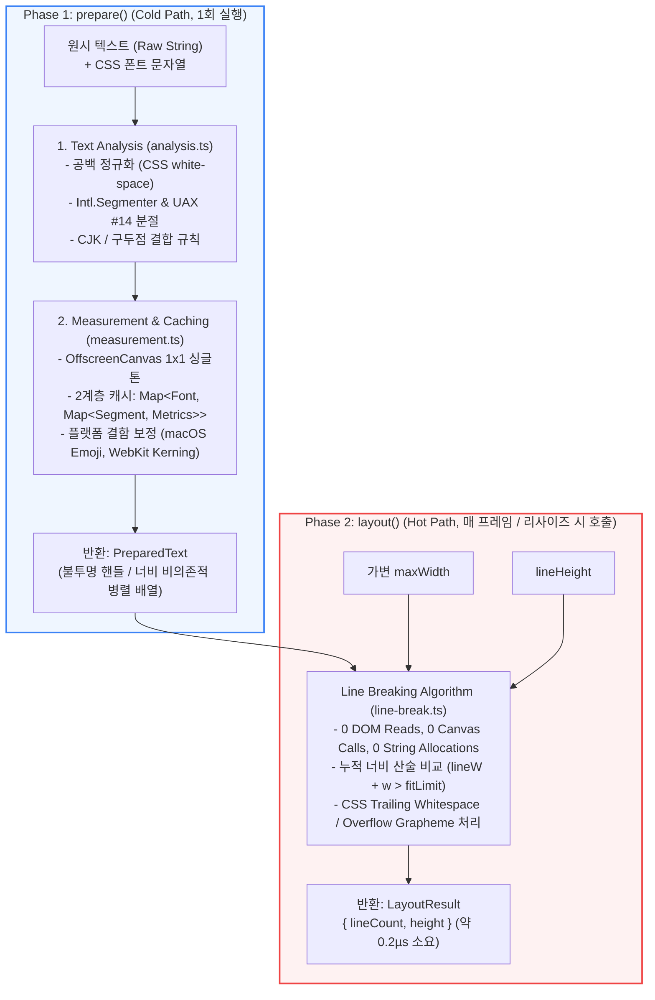

# Pretext 핵심 엔진 심층 분석: `prepare()` & `layout()`

> 이 문서는 `@chenglou/pretext` 라이브러리의 핵심 공개 API인 **`prepare()`**와 **`layout()`** 단 2개 함수의 내부 코드 구조, 데이터 흐름, 알고리즘 및 동작 원리를 소스 코드 레벨(`src/layout.ts`, `src/analysis.ts`, `src/measurement.ts`, `src/line-break.ts`)에서 심층 분석한 기술 문서입니다.

---

## 1. 개요: 2-Phase Text Layout 아키텍처

웹 브라우저(Blink, WebKit, Gecko)의 텍스트 렌더링은 다음과 같은 파이프라인 구조적 한계를 지닙니다:
1. **Layout Thrashing (강제 동기 리플로우)**: 텍스트의 실제 높이나 줄바꿈을 확인하기 위해 DOM 요소의 `scrollHeight`, `clientHeight`, `getBoundingClientRect()` 등을 읽는 순간, 브라우저는 메인 스레드를 멈추고 스타일 재계산(Recalc Style) 및 레이아웃 재계산(Layout Tree 연쇄 업데이트)을 즉시 강제 수행합니다.
2. **동적 컨테이너 크기 변경의 비효율성**: 윈도우 리사이즈, 사이드바 토글, 가상 스크롤(Virtual Scroll) 등 너비(`maxWidth`)가 변할 때마다 수백~수천 개의 DOM 노드를 역측정하면 프레임 드랍(Jank)이 필연적으로 발생합니다.

Pretext는 이 문제를 해결하기 위해 브라우저 렌더링 파이프라인의 **Text Formatting Context(TFC)**를 순수 자바스크립트 엔진으로 독립시켜 **2단계(2-Phase) 파이프라인**으로 분리했습니다.



- **`prepare()`**: **너비 비의존적(Width-Independent)**인 사전 계산 단계 (Cold Path). 텍스트 분석, 세그멘테이션, OffscreenCanvas 측정을 수행하고 전역 캐시에 보관합니다.
- **`layout()`**: **너비 의존적(Width-Dependent)**인 실시간 배치 단계 (Hot Path). DOM과 캔버스를 일절 건드리지 않고, 오직 CPU 메모리 상의 정수/부동소수점 산술 연산만으로 줄 수와 총 높이를 약 **0.0002ms(0.2µs)** 내에 산출합니다.

---

## 2. `prepare()` 심층 분석

### 2.1 함수 시그니처 및 타입 정의

```typescript
// src/layout.ts
export function prepare(
  text: string,
  font: string,
  options?: PrepareOptions
): PreparedText;

export type PrepareOptions = {
  whiteSpace?: 'normal' | 'pre-wrap'; // 기본값: 'normal'
  wordBreak?: 'normal' | 'keep-all';   // 기본값: 'normal'
  letterSpacing?: number;              // 기본값: 0 (px 단위)
};

// 외부로 노출되는 불투명(Opaque) 브랜디드 타입
declare const preparedTextBrand: unique symbol;
export type PreparedText = {
  readonly [preparedTextBrand]: true;
};
```

#### 불투명 핸들(Opaque Handle) 패턴
사용자 코드에 반환되는 `PreparedText`는 `unique symbol`을 가진 불투명 객체입니다. 이는 라이브러리 외부에서 내부 배열 구조에 의존하지 못하게 막고, 런타임에 내부적으로 `PreparedCore` 병렬 배열 구조로 즉시 안전하게 타입 캐스팅(`getInternalPrepared()`)하여 사용합니다.

```typescript
// src/layout.ts - 실제 내부 저장 구조
type PreparedCore = {
  widths: number[];                    // 각 세그먼트의 측정된 픽셀 너비 (예: [42.5, 4.4, 37.2])
  kinds: SegmentBreakKind[];          // 각 세그먼트의 줄바꿈 특성 ('text', 'space', 'tab' 등)
  simpleLineWalkFastPath: boolean;    // letter-spacing 등이 없는 일반 텍스트용 초고속 경로 플래그
  segLevels: Int8Array | null;        // Rich 렌더러를 위한 BiDi 레벨 (layout()에서는 읽지 않음)
  breakableFitAdvances: (number[] | null)[]; // 단어 오버플로 시 자모/grapheme 단위 너비 배열
  breakablePreferredBreaks: (number[] | null)[]; // 하이픈/단어 내 선호 줄바꿈 위치
  letterSpacing: number;              // 적용된 자간 값
  spacingGraphemeCounts: number[];    // 자간 적용 대상 grapheme 수
  discretionaryHyphenWidth: number;   // soft-hyphen (&shy;) 활성화 시 렌더링 너비
  discretionaryHyphenContexts: boolean[] | null;
  tabStopAdvance: number;             // 탭 정지 간격 (spaceWidth * 8)
  chunks: PreparedLineChunk[];        // 강제 개행(\n)으로 구분된 독립 청크 범위
};
```

---

### 2.2 `prepare()` 내부 실행 파이프라인

`prepare()`는 `prepareInternal()`을 거쳐 2가지 내부 핵심 단계로 진입합니다:
1. **텍스트 분석 (Text Analysis)**: `analyzeText()` (`src/analysis.ts`)
2. **측정 및 캐싱 (Measurement & Caching)**: `measureAnalysis()` (`src/layout.ts`, `src/measurement.ts`)

```typescript
// src/layout.ts
function prepareInternal(
  text: string,
  font: string,
  includeSegments: boolean,
  options?: PrepareOptions,
): InternalPreparedText | PreparedTextWithSegments {
  const wordBreak = options?.wordBreak ?? 'normal';
  const letterSpacing = options?.letterSpacing ?? 0;
  
  // 1. 현재 문서의 언어 속성(<html lang>)을 단 1회 읽어 엔진 프로파일 결정
  const documentLanguage = getDocumentLanguage();
  const engineProfile = getEngineProfile(getBreakLanguage(documentLanguage));
  
  // 2. 텍스트 분석 (정규화 및 세그멘테이션)
  const analysis = analyzeText(text, engineProfile, options?.whiteSpace, wordBreak);
  
  // 3. 폰트 메트릭 측정 및 너비 배열 생성
  return measureAnalysis(analysis, font, includeSegments, wordBreak, letterSpacing, engineProfile, documentLanguage);
}
```

---

### 2.3 세부 단계 1: 텍스트 분석 (`analyzeText` in `src/analysis.ts`)

#### ① 공백 정규화 (CSS White-Space Normalization)
CSS `white-space: normal` 명세에 따라 불필요한 공백을 표준화합니다:
- 탭(`\t`), 개행(`\n`, `\r`), 폼피드(`\f`)를 일반 공백(` `)으로 치환.
- 연속된 2개 이상의 공백(`  +`)을 단일 공백(` `)으로 병합(Collapsing).
- 텍스트 시작과 끝의 여백 처리.
- `whiteSpace: 'pre-wrap'` 모드일 경우 원본 개행과 탭을 유지하면서 유니코드 줄바꿈 시퀀스(`\r\n` -> `\n`)만 정규화.

#### ② 유니코드 세그멘테이션 (Intl.Segmenter & UAX #14)
브라우저 내장 `Intl.Segmenter`와 유니코드 표준 UAX #14(Line Breaking Algorithm) 규칙을 결합하여 문자열을 최소 분절 단위(Segment)로 쪼갭니다:
- **단어 및 구두점 결합**: `"hello,"`나 `"world."`처럼 단어 뒤에 바로 붙은 구두점은 분리하지 않고 단어와 하나의 세그먼트로 결합하여 구두점만 홀로 다음 줄로 떨어지는 현상을 방지합니다.
- **CJK 문자 분절**: 한글, 일본어, 중국어 등 동아시아 문자는 단어 단위가 아닌 글자(Grapheme) 단위로 개행이 가능하므로 별도의 CJK 분절 로직(`getCjkTextUnits`)을 거칩니다.
- **`word-break: keep-all` 지원**: 한글/한자 문맥에서 단어 중간 줄바꿈을 억제하는 옵션이 주어지면 `mergeKeepAllTextSegments()`를 통해 연속된 단어형 문자를 단일 세그먼트로 병합합니다.

#### ③ 세그먼트 브레이크 종류 분류 (`SegmentBreakKind`)
각 분절 조각에 브레이크 특성 태그를 부여합니다:
- `'text'`: 일반 텍스트 단어.
- `'space'`: 연속 공백이 병합된 줄바꿈 가능 여백.
- `'preserved-space'`: `pre-wrap` 모드에서 보존된 고정 공백.
- `'tab'`: 탭 문자 (`\t`).
- `'hard-break'`: 명시적 개행 문자 (`\n`).
- `'soft-hyphen'`: 조건부 하이픈 (`&shy;`, `\u00AD`).
- `'zero-width-break'`: 폭 없는 공백 (`\u200B`, ZWSP).

---

### 2.4 세부 단계 2: 측정 및 2계층 캐싱 (`measureAnalysis` & `src/measurement.ts`)

#### ① 1x1 OffscreenCanvas 싱글톤 컨텍스트
Pretext는 DOM 요소를 생성하지 않고 메모리 상의 `OffscreenCanvas`를 재사용하여 측정합니다.
```typescript
// src/measurement.ts
let measureContext: CanvasRenderingContext2D | OffscreenCanvasRenderingContext2D | null = null;

function createMeasureContext(language: string | null) {
  if (typeof OffscreenCanvas !== 'undefined') {
    measureContext = new OffscreenCanvas(1, 1).getContext('2d')!;
    return measureContext;
  }
  if (typeof document !== 'undefined') {
    // OffscreenCanvas 미지원 구형 환경 fallback
    measureContext = document.createElement('canvas').getContext('2d')!;
    return measureContext;
  }
  throw new Error('Text measurement requires OffscreenCanvas or a DOM canvas context.');
}
```

#### ② 2계층 메트릭 캐시 (`segmentMetricCaches`)
동일한 단어와 문장은 서로 다른 컴포넌트나 리스트 아이템에 반복해서 등장합니다. Pretext는 이를 폰트별, 세그먼트별로 전역 캐싱합니다:
$$\text{Cache Map}: \text{Font String} \longrightarrow \Big( \text{Segment String} \longrightarrow \text{SegmentMetrics} \Big)$$

```typescript
// src/measurement.ts
const segmentMetricCaches = new Map<string, Map<string, SegmentMetrics>>();

export function getSegmentMetrics(seg: string, cache: Map<string, SegmentMetrics>): SegmentMetrics {
  let metrics = cache.get(seg);
  if (metrics === undefined) {
    const ctx = getMeasureContext();
    metrics = { width: ctx.measureText(seg).width };
    cache.set(seg, metrics);
  }
  return metrics;
}
```
- **효과**: 화면에 10,000개의 댓글이 표시되어도 `"안녕하세요"`, `"좋아요"`, `"댓글"` 같은 반복 단어는 브라우저 수명 주기 동안 단 **1번만 Canvas `measureText()`를 호출**하며, 이후 모든 호출은 $O(1)$ 해시맵 조회가 됩니다.

#### ③ 브라우저 엔진 결함 보정 (Platform Bug Workarounds)
- **macOS / Safari 이모지 너비 팽창 버그**:
  - macOS 캔버스는 이모지(`😀`)를 측정할 때 실제 폰트 크기보다 2~4px 넓게 측정하여 줄바꿈 오차를 일으킵니다.
  - Pretext는 `getEmojiCorrection(font)`에서 기준 이모지(`\u{1F600}`)를 1회 보정 측정하여 이모지가 포함된 세그먼트 너비에서 오차를 자동으로 감산합니다.
- **WebKit Trailing Space Kerning**:
  - Safari WebKit은 단어 바로 뒤에 공백이 올 때 글리프 커닝(Kerning)을 단어에 포함시켜 계산합니다.
  - `followingSpaceMetricCaches`를 두어 단어 뒤에 공백이 붙는 경우(`"word "`)의 커닝 차이를 정밀하게 계산합니다.
- **단어 오버플로 사전 대비 (`breakableFitAdvances`)**:
  - 매우 긴 영문 단어나 URL(`https://example.com/a/b/c...`)은 `maxWidth`보다 커질 수 있습니다.
  - 이를 대비해 단어 내부 글자(Grapheme) 단위의 누적 너비를 사전에 계산하여 저장하므로, `layout()` 시점에 문자열을 자르지 않고도 즉시 줄바꿈을 계산할 수 있습니다.

---

## 3. `layout()` 심층 분석

### 3.1 함수 시그니처 및 설계 원칙

```typescript
// src/layout.ts
export function layout(
  prepared: PreparedText,
  maxWidth: number,
  lineHeight: number
): LayoutResult;

export type LayoutResult = {
  lineCount: number; // 총 줄 수 (예: 3)
  height: number;    // 총 블록 높이 (lineCount * lineHeight, 예: 60)
};
```

#### 극단적 최적화를 위한 "Zero-Overhead" 4대 원칙
`layout()`은 창 크기를 드래그하여 조절하거나 스크롤할 때 **초당 60~120회(매 프레임)** 반복 호출되는 **최극단의 Hot Path**입니다. 따라서 다음 연산이 철저하게 배제되어 있습니다:
1. **0 DOM Access**: DOM 속성 읽기, 클래스 변경, 스타일 쿼리 전무 $\rightarrow$ **Reflow 발생 확률 0%**.
2. **0 Canvas Calls**: `measureText()` 호출 전무.
3. **0 String Operations**: `split()`, `slice()`, `substring()`, 정규식 연산 전무.
4. **0 Per-line Allocations**: 줄마다 새 배열이나 객체를 만들지 않고, 루프 내에서 단 2개의 숫자 변수(`lineCount`, `lineW`)만 갱신.

---

### 3.2 `layout()` 내부 구현: `countPreparedLines` (`src/line-break.ts`)

`layout()`은 `countPreparedLines`를 호출하며, 기본 텍스트의 경우 가장 최적화된 **Fast-Path 워커(`walkPreparedLinesSimple`)**로 진입합니다.

```typescript
// src/layout.ts
export function layout(prepared: PreparedText, maxWidth: number, lineHeight: number): LayoutResult {
  const lineCount = countPreparedLines(getInternalPrepared(prepared), maxWidth);
  return { lineCount, height: lineCount * lineHeight };
}
```

```typescript
// src/line-break.ts
export function countPreparedLines(prepared: PreparedLineBreakData, maxWidth: number): number {
  return walkPreparedLinesRaw(prepared, maxWidth);
}

export function walkPreparedLinesRaw(prepared: PreparedLineBreakData, maxWidth: number): number {
  if (prepared.simpleLineWalkFastPath) {
    return walkPreparedLinesSimple(prepared, maxWidth);
  }
  // BiDi 또는 특수 letter-spacing이 있는 경우 complex 라인 워커 실행
  return walkPreparedComplexLines(prepared, ...).lineCount;
}
```

---

### 3.3 핵심 줄바꿈 알고리즘: `walkPreparedLinesSimple` 분석

`walkPreparedLinesSimple`은 CSS 명세인 `white-space: normal` 및 `overflow-wrap: break-word`를 완벽히 모사하는 순수 산술 루프입니다.

```typescript
// src/line-break.ts (핵심 로직 요약)
function walkPreparedLinesSimple(
  prepared: PreparedLineBreakData,
  maxWidth: number,
): number {
  const { widths, kinds, breakableFitAdvances } = prepared;
  if (widths.length === 0) return 0;

  // 브라우저별 서브픽셀 부동소수점 오차 입실론 반영 (WebKit: 1/64px, Blink: 0.005px)
  const engineProfile = getEngineProfile();
  const fitLimit = maxWidth + engineProfile.lineFitEpsilon;

  let lineCount = 0;
  let lineW = 0;              // 현재 줄의 누적 너비
  let hasContent = false;      // 현재 줄에 실제 렌더링 문자가 존재하는가
  let pendingBreakSegmentIndex = -1; // 직전 줄바꿈 가능 지점(공백 위치)

  let i = 0;
  while (i < widths.length) {
    // 1. 줄 시작 부분의 불필요한 앞쪽 공백 건너뛰기
    if (!hasContent) {
      i = normalizeLineStartSegmentIndex(prepared, i, widths.length, i === 0);
      if (i >= widths.length) break;
    }

    const w = widths[i]!;
    const kind = kinds[i]!;
    const breakAfter = breaksAfter(kind); // kind === 'space' | 'tab' | 'zero-width-break' 등

    // 2. 현재 줄의 첫 단어 배치
    if (!hasContent) {
      if (w > fitLimit && breakableFitAdvances[i] !== null) {
        // 단어 하나가 줄 너비 전체를 초과할 경우: 사전 계산된 grapheme 단위로 쪼개기
        appendBreakableSegmentFrom(i, 0);
      } else {
        hasContent = true;
        lineW = w;
      }
      if (breakAfter) pendingBreakSegmentIndex = i + 1;
      i++;
      continue;
    }

    // 3. 기존 줄에 다음 세그먼트 추가 시도
    const newW = lineW + w;

    if (newW > fitLimit) {
      // [오버플로 발생!]
      
      // A. 만약 현재 요소가 공백/줄바꿈 문자라면: CSS Trailing Whitespace 규칙
      // 줄 끝에 걸친 공백은 다음 줄로 넘기지 않고 줄 끝에 매달리며 줄을 종료시킴
      if (breakAfter) {
        lineCount++;
        lineW = 0;
        hasContent = false;
        pendingBreakSegmentIndex = -1;
        i++;
        continue;
      }

      // B. 이전에 공백 등 줄바꿈 기회가 있었던 경우: 그 직전 위치에서 줄바꿈 확정
      if (pendingBreakSegmentIndex >= 0) {
        lineCount++;
        lineW = 0;
        hasContent = false;
        pendingBreakSegmentIndex = -1;
        // i는 증가시키지 않고 현재 단어를 다음 줄의 첫 단어로 다시 검사
        continue;
      }

      // C. 공백 없는 긴 단어가 줄 중간에서 넘치는 경우: 강제 개행
      lineCount++;
      lineW = 0;
      hasContent = false;
      continue;
    }

    // [정상 수용] 너비 누적
    lineW = newW;
    if (breakAfter) {
      pendingBreakSegmentIndex = i + 1;
    }
    i++;
  }

  // 마지막 줄 잔여 컨텐츠 확정
  if (hasContent) lineCount++;

  return lineCount;
}
```

#### 알고리즘 핵심 메커니즘
1. **Trailing Whitespace Hanging (CSS 스펙 충실도)**:
   - CSS 표준에 따르면 줄 끝에 위치하는 일반 공백은 다음 줄로 개행되지 않고 행 끝 여백 밖으로 매달립니다(Hanging).
   - `if (breakAfter)` 분기를 통해 공백 세그먼트가 `fitLimit`를 넘어도 다음 줄로 글자를 넘기지 않고 즉시 현재 행을 종료시킵니다.
2. **Pending Break Backtracking**:
   - 단어가 줄 너비를 넘겼을 때, 무작정 단어를 쪼개는 것이 아니라 가장 최근에 만났던 공백(`pendingBreakSegmentIndex`) 위치로 안전하게 되돌아가 줄을 나눕니다.
3. **Emergency Break-Word (Grapheme Fallback)**:
   - 컨테이너 폭이 좁아 단일 단어가 `maxWidth`보다 넓을 경우(`w > fitLimit`), 문자열을 자르지 않고 `prepare()`에서 구해둔 `breakableFitAdvances` 배열의 누적합을 비교하여 즉각 자모 단위 줄바꿈을 수행합니다.

---

## 4. `prepare()` vs `layout()` 아키텍처 비교 요약

| 비교 항목 | `prepare(text, font, options)` | `layout(prepared, maxWidth, lineHeight)` |
| :--- | :--- | :--- |
| **실행 위상 (Phase)** | **Phase 1: Cold Path** (초기화 단계) | **Phase 2: Hot Path** (상호작용 / 렌더링 단계) |
| **호출 시점** | 데이터 로드 시 (댓글/글 최초 수신 시 1회) | 창 리사이즈, 스크롤, 슬라이더 변경 시 매 프레임 |
| **너비 의존성** | **너비 비의존적 (Width-Independent)** | **너비 의존적 (Width-Dependent)** |
| **실행 주기** | 텍스트 변경 시 1회 | 컨테이너 너비 변경 시 수십~수천 회 |
| **주요 작업** | 공백 정규화, Intl 세그멘테이션, Canvas 측정 | 배열 순회, 부동소수점 누적 합산, 줄바꿈 판정 |
| **DOM 접근** | ❌ 전무 (최초 이모지 보정 1회 제외) | ❌ **0회 (절대 금지)** |
| **Canvas API 호출** | ⚠️ 미캐시 단어만 호출 (`measureText`) | ❌ **0회 (절대 금지)** |
| **GC 메모리 할당** | 세그먼트 배열 및 메트릭 객체 생성 | ❌ **새 객체 할당 0개** (정수/실수만 반환) |
| **소요 시간** | **~0.05ms** (캐시 히트 시 **~0.005ms**) | **~0.0002ms (약 0.2µs = 200ns)** |
| **반환값** | `PreparedText` (불투명 핸들) | `{ lineCount, height }` |

---

## 5. 실전 적용 패턴 및 권장 사용법

### 5.1 기본 사용 패턴 (Single Text Block)

```typescript
import { prepare, layout } from '@chenglou/pretext';

// 1. [Cold Path] 텍스트와 폰트를 준비합니다 (네트워크 수신 시 1회만 실행)
const FONT = '16px Inter, sans-serif';
const LINE_HEIGHT = 24;
const text = "Pretext optimizes web text rendering by separating preparation and layout.";

const prepared = prepare(text, FONT, {
  whiteSpace: 'normal',
  wordBreak: 'keep-all'
});

// 2. [Hot Path] 리사이즈 이벤트 또는 레이아웃 업데이트 루프에서 호출합니다.
function onResize(containerWidth: number) {
  // DOM Reflow 없이 0.2µs만에 완벽한 높이 예측
  const { lineCount, height } = layout(prepared, containerWidth, LINE_HEIGHT);
  
  console.log(`줄 수: ${lineCount}, 총 높이: ${height}px`);
  // 대상 DOM 요소에 style.height = `${height}px`를 직접 부여하거나 가상 스크롤러에 전달
}
```

### 5.2 가상화 리스트(Virtual List)에서의 극적 최적화 패턴

기존 가상 리스트(`react-window`, `TanStack Virtual`)는 가변 높이 항목을 렌더링하기 위해 다음 단계를 거쳐야 했습니다:
1. 보이지 않는 영역에 더미 DOM 렌더링
2. `getBoundingClientRect()`로 실제 높이 역측정 $\rightarrow$ **Layout Thrashing 발생**
3. 측정된 높이를 캐시에 반영하고 다시 렌더링

**Pretext를 결합한 Zero-DOM 가상 리스트 패턴**:
```typescript
// 1. 데이터 수신 즉시 모든 아이템을 prepare()
const preparedItems = items.map(item => ({
  id: item.id,
  prepared: prepare(item.content, '14px system-ui')
}));

// 2. 윈도우 리사이즈 시 10,000개 아이템의 전체 스크롤 높이를 2ms 안에 계산!
function calculateTotalListHeight(containerWidth: number): number {
  let totalHeight = 0;
  for (let i = 0; i < preparedItems.length; i++) {
    // 10,000번 호출해도 약 2ms 소요 (1회당 0.0002ms)
    const { height } = layout(preparedItems[i].prepared, containerWidth, 20);
    totalHeight += height;
  }
  return totalHeight;
}
```
DOM을 단 한 번도 마운트하지 않고도 수만 개 아이템의 전체 스크롤 높이와 각 인덱스의 오프셋을 정확히 예측하여 완벽한 60fps 스크롤 경험을 제공합니다.
