# 📑 PRETEXT

### 📋 목차
- 📌 배경설명
- 🎨 C.L. 의 미드저니 트러블 슈팅 (이미지 피드와 프롬프트 병목 & Zero-DOM 파이프라인)
- ⚙️ 웹브라우저 렌더링 파이프라인 (Chromium / WebKit)
  - 📥 Layout queueing & VSync 스케줄링 (Viz & BeginMainFrame)
  - 🔥 텍스트 강제 동기 레이아웃 (Forced Synchronous Layout / Layout Thrashing)
  - 💥 VSync 주기를 무너뜨리는 강제 동기 레이아웃 (Layout Thrashing) 케이스
- 💡 해결한 방법
  - 2-Phase Engine (Prepare - Layout 분리)
  - 브라우저 동작 일치성 검증 (Corpora Verification)
  - 🔬 실제 패키지 코드 구조 분석 (@chenglou/pretext)
  - 🔠 CSS white-space 속성과 Pretext의 공백/줄바꿈 에뮬레이션
  - 🧪 캔버스 측정과 브라우저 전달 메커니즘 심층 분석 (Deep Dive)
- ⚠️ 제한 사항
- 🚀 응용방법
- 🧩 주목할만한 패턴
- 🎬 wrap-up

---

#### 📝 정리 #### 

## 🔍 PRETEXT

---

## 📌 배경설명

> 웹 프론트엔드 개발에서 텍스트의 크기와 줄바꿈(multiline text layout)에 따른 높이를 계산하는 작업은 언제나 렌더링 파이프라인의 심각한 병목 지점이었습니다.

- **🚨 동적 텍스트 측정의 딜레마**: 가상 스크롤(Virtual List), 메이슨리(Masonry), 동적 피드, AI 실시간 스트리밍 인터페이스 등에서는 요소가 화면에 나타나기 전 정확한 크기를 알아야 레이아웃 시프트(CLS)를 방지할 수 있습니다.
- **⏳ 전통적인 접근의 한계**: 개발자들은 높이를 대략적으로 추정(Heuristic Guess)하여 스크롤 덜컹거림을 감수하거나, 보이지 않는 DOM에 텍스트를 임시로 렌더링한 후 크기를 측정하는 방식을 택해 왔습니다.
- **💥 DOM 의존성의 문제**: 브라우저 내부 레이아웃 엔진에 전적으로 의존하는 한, 빈번한 텍스트 크기 계산은 프레임 드랍(Jank)과 성능 저하를 피할 수 없었습니다.

---

## 🎨 C.L. 의 미드저니 트러블 슈팅 (이미지 피드와 프롬프트 병목 & Zero-DOM 파이프라인)

> Cheng Lou(전 React 코어 팀 멤버, react-motion 제작자)는 Midjourney의 웹 프론트엔드 아키텍처를 총괄하며 상상을 초월하는 극단적인 성능 요구사항과 마주했습니다.

### ❓ "미드저니는 이미지 피드인데, 왜 텍스트 라이브러리(Pretext)로 최적화했을까?"

미드저니는 겉보기에는 화려한 "이미지 갤러리"처럼 보이지만, 아키텍처 관점에서 본질은 **"고정 종횡비 이미지 + 가변 길이 텍스트(프롬프트)"가 결합된 초고밀도 카드 피드**입니다. 바로 이 독특한 카드 구조가 웹 브라우저 렌더링 파이프라인을 완전히 마비시키는 치명적인 병목을 일으켰습니다.

---

### 1. 이미지는 원래 높이 계산이 쉽다 (AspectRatio의 함정)

피드에서 **이미지 영역 자체의 높이는 브라우저 렌더링 없이도 0ms에 순수 수학으로 즉시 계산**할 수 있습니다.
- 이미지는 생성 시점부터 종횡비(예: 16:9, 1:1, 2:3)와 원본 해상도 메타데이터를 API로 함께 전달받습니다.
- 컨테이너 너비(`cardWidth`)가 300px이고 비율이 16:9라면:
  $$\text{이미지 높이} = \frac{\text{카드 너비}}{\text{종횡비}} = \frac{300}{16 / 9} = 168.75\text{px}$$
- DOM을 그려보지 않아도 자바스크립트 나눗셈 1번으로 높이가 오차 없이 즉시 확정됩니다.

---

### 2. 미드저니 카드의 진짜 병목: 가변 프롬프트 텍스트

미드저니의 모든 이미지 카드 하단에는 AI 생성에 사용된 프롬프트 문자열이 반드시 부착되어 있습니다:
- 어떤 프롬프트는 단 1줄: `"a cute cat"`
- 어떤 프롬프트는 10줄 이상의 초장문: `"cinematic lighting, ultra detailed 8k, unreal engine 5, photorealistic portrait of an old cyberpunk warrior in neo-seoul, highly intricate, octane render, volumetric lighting, ..." --ar 16:9 --v 6.0`

메이슨리(Masonry, 벽돌 쌓기) 그리드나 가상 스크롤에 카드를 배치하려면 **카드 1개의 전체 물리적 높이**를 알아야 합니다:
$$\text{카드 전체 높이} = \text{이미지 높이} + \text{텍스트 높이} + \text{고정 UI(패딩, 버튼 등)}$$

#### 💥 기존 DOM 기반 역측정의 참사
1. 카드를 화면에 표시하기 전, 보이지 않는 곳(오프스크린 DOM)에 카드를 임시로 마운트합니다.
2. 프롬프트 텍스트가 현재 카드 너비에서 몇 줄로 꺾이는지 브라우저에게 `card.offsetHeight`로 물어봅니다.
3. 피드에 카드가 수백~수천 장이고 사용자가 창 크기를 조금만 조절해도, 수천 개의 카드가 일제히 줄바꿈을 재계산하며 수천 번의 **강제 동기 레이아웃(Layout Thrashing: `Document::UpdateStyleAndLayout`)**이 폭발합니다.
4. 렌더러 메인 스레드가 마비되어 윈도우 리사이징 프레임이 **10fps 이하로 곤두박질**치며 브라우저 탭이 사실상 멈춰 버렸습니다.

---

### 3. 미드저니가 완성한 "완전 사전 계산(Zero-DOM)" 파이프라인

Pretext 엔진을 도입하면서 미드저니는 **단 1개의 DOM 노드도 생성하거나 측정하지 않고**, 카드 1,000개의 정확한 2차원 절대 좌표(X, Y)와 높이를 마이크로초(µs) 단위로 사전 확정하는 아키텍처를 완성했습니다.

```text
[API 응답 수신: 이미지 종횡비 메타데이터, 프롬프트 문자열]
                           │
                           ▼
┌─────────────────────────────────────────────────────────────┐
│ 1. 이미지 높이 계산 (순수 나눗셈, 0ms)                       │
│    imageHeight = cardWidth / aspectRatio                    │
├─────────────────────────────────────────────────────────────┤
│ 2. 프롬프트 텍스트 높이 계산 (Pretext layout, 0.0002ms)      │
│    textHeight = layout(preparedPrompt, textWidth, 22).height│
├─────────────────────────────────────────────────────────────┤
│ 3. 고정 UI 마진 합산 (상수 덧셈, 0ms)                        │
│    fixedOverhead = paddingTopBottom + buttonHeight          │
└─────────────────────────────────────────────────────────────┘
                           │
                           ▼
     [카드 전체 높이(Height) 100% 확정 (DOM 개입 0회!)]
                           │
                           ▼
┌─────────────────────────────────────────────────────────────┐
│ 4. 메이슨리 배치 알고리즘 실행 (메모리 상 Float64Array)      │
│    가장 높이가 낮은 열(Shortest Column)을 찾아 좌표 계산    │
│    x = colIndex * (colWidth + gap)                          │
│    y = colHeights[colIndex]                                 │
├─────────────────────────────────────────────────────────────┤
│ 5. 브라우저 GPU 합성(Compositor Thread)으로 직행!           │
│    transform: translate3d(x, y, 0) 인라인 스타일 주입       │
│    ➔ StyleRecalc / LayoutNG / Paint 완전 건너뜀 (60~120fps)  │
└─────────────────────────────────────────────────────────────┘
```

1. **이미지 높이**: 너비와 종횡비로 즉시 수학적 계산.
2. **텍스트 높이**: Pretext의 너비 배열 기반 Greedy 산술 연산으로 0.0002ms 만에 높이 도출.
3. **메이슨리 좌표 확정**: DOM에 카드를 꽂아보지 않고도 메모리 상의 `Float64Array` 누적 높이 배열로 각 열의 (x, y)를 즉시 계산.
4. **GPU 합성(Composite) 직행**: 브라우저에는 완성된 물리 좌표인 `transform: translate3d(x, y, 0)`만 전달하여, 메인 스레드의 Layout/Paint를 완전히 생략하고 GPU 합성만으로 60~120fps 고주사율 무감속 스크롤을 달성했습니다.

---

### 4. 반응형 리사이징 시의 압도적 위력

사용자가 브라우저 창 너비를 마우스로 드래그하여 줄이면 열 개수가 4열에서 3열로 바뀌고, 카드 너비도 줄어듭니다.  
카드 너비가 줄어들면 수백 개 카드의 프롬프트 텍스트 줄바꿈이 일제히 다시 일어나야 합니다.
- **기존 방식**: 창을 줄이는 순간 수백 번의 동기 리플로우가 연쇄 발생하여 브라우저 창 조절 자체가 버벅임.
- **Pretext 방식**: 이미 1회성 전처리(`prepare`)를 통해 단어별 픽셀 폭(`widths: number[]`)이 메모리에 캐싱되어 있으므로, 300개 카드의 줄바꿈과 높이를 **1ms 미만의 순수 산술 연산**으로 재계산합니다.
- **결과**: 창 크기를 아무리 격하게 흔들어도 프레임 드랍 없이 모든 카드가 자석처럼 부드럽게 재배치됩니다.

---

### 5. 💡 "Pretext 라이브러리 자체에 카드 높이 계산 기능이 있는가?"

> **아닙니다.** Pretext 라이브러리 내부에는 카드 높이나 이미지 박스를 계산해 주는 기능이 **전혀 없습니다.**  
> Pretext는 오직 **'플레인 텍스트의 줄바꿈 시뮬레이션 및 높이 도출' 딱 하나만 극도로 정밀하게 수행하는 초경량 특화 엔진**입니다.

그럼 미드저니 같은 서비스에서 카드 높이는 어떻게 완성되었을까요?  
바로 **"개발자가 작성한 카드 전체 높이 계산식의 '유일한 미지의 빈 퍼즐 조각'을 Pretext가 채워준 것"**입니다.

$$\text{카드 전체 높이} = \underbrace{\text{이미지 높이}}_{\text{종횡비 나눗셈 (0ms)}} + \underbrace{\mathbf{텍스트 높이}}_{\mathbf{Pretext layout (0.0002ms)}} + \underbrace{\text{고정 UI}}_{\text{CSS 상수 덧셈 (0ms)}}$$

```typescript
// 개발자 애플리케이션 레벨의 순수 산술 합성 코드
// 1. 이미지는 원래 순수 수학으로 나옴 (API 메타데이터 활용)
const imageHeight = cardWidth / imageAspectRatio

// 2. 고정 UI는 개발자가 지정한 고정 픽셀 상수
const fixedUiHeight = 16 + 16 + 40 // 상하 패딩(32px) + 액션 버튼(40px)

// 3. [유일한 난제였던 지점] 텍스트 높이 -> Pretext가 DOM 없이 순수 숫자로 해결!
const { height: textHeight } = layout(card.preparedPrompt, textWidth, lineHeight)

// 4. 최종 카드 전체 높이 도출 (DOM 렌더링 전 100% 확정)
const totalCardHeight = imageHeight + textHeight + fixedUiHeight
```

- **왜 Pretext가 결정적이었는가?**:  
  이미지 높이와 패딩/버튼 높이는 원래 브라우저 없이도 즉시 알 수 있었습니다.  
  그러나 **오직 '가변 텍스트 높이' 하나 때문에** 어쩔 수 없이 카드를 임시 DOM에 렌더링하고 `offsetHeight`를 호출해야만 했고, 이것이 전체 렌더링 파이프라인을 마비시키고 있었습니다.  
  Pretext가 이 유일한 병목을 순수 산술식으로 풀어냄으로써, **카드 전체 높이와 2차원 배치 좌표를 100% 자바스크립트 산술 연산만으로 완성**할 수 있게 된 것입니다.

---

### 6. 🧪 관련 실습 및 공식 데모 코드 연계

이 미드저니 트러블슈팅과 제로 리플로우 메이슨리 파이프라인은 로컬 저장소 및 샘플 샌드박스에서 직접 코드로 확인하고 테스트할 수 있습니다.

| 데모 위치 | 주요 구현 내용 및 테스트 포인트 |
| :--- | :--- |
| **로컬 React 인터랙티브 앱**<br>[`sample/src/demos/MasonryDemo.tsx`](file:///Users/jake/development/memo/docs/pretext/sample/src/demos/MasonryDemo.tsx) | - `prepare()`로 타이틀/본문 텍스트 사전 준비 ([#L76-L82](file:///Users/jake/development/memo/docs/pretext/sample/src/demos/MasonryDemo.tsx#L76-L82))<br>- `colHeights` 배열 기반 최단 열 탐색 및 선제적 좌표 부여 ([#L98-L128](file:///Users/jake/development/memo/docs/pretext/sample/src/demos/MasonryDemo.tsx#L98-L128))<br>- **[DOM 역측정 연쇄 리플로우 시뮬레이션 버튼]** 제공: `offsetHeight` 호출 시 발생하는 레이아웃 스래싱을 시각적/체감적으로 직접 비교 가능 |
| **실제 TanStack 무한스크롤 피드**<br>[`sample/src/demos/TanStackFeedDemo.tsx`](file:///Users/jake/development/memo/docs/pretext/sample/src/demos/TanStackFeedDemo.tsx) | - `@tanstack/react-virtual` 가상화 엔진의 `estimateSize`에 Pretext 사전 계산 높이 100% 정밀 주입<br>- `measureElement` 동적 DOM 역측정을 완전히 제거하여 스크롤 시 리플로우 0회 보장<br>- `transform: translate3d(0, y, 0)` 인라인 스타일로 브라우저 GPU 합성(Composite) 단계로 직행 |
| **Pretext 공식 저장소 메이슨리**<br>[`pages/demos/masonry/index.ts`](file:///Users/jake/development/pretext/pages/demos/masonry/index.ts) | - Cheng Lou가 작성한 순수 TS 기반 메이슨리 그리드 엔진<br>- 창 리사이즈 시 `computeLayout()`을 통해 수백 개의 카드를 1ms 안에 재배치 ([#L55-L99](file:///Users/jake/development/pretext/pages/demos/masonry/index.ts#L55-L99))<br>- `transform` 절대 좌표만 갱신하여 120Hz 무감속 렌더링 증명 |

---

## ⚙️ 웹브라우저 렌더링 파이프라인 (Chromium / WebKit)

현대 모바일 및 데스크톱 웹 생태계를 양분하는 **크롬 웹뷰(Android WebView: Chromium/Blink)**와 **사파리 웹뷰(iOS WKWebView: WebKit)**는 공통적으로 아래와 같은 렌더링 파이프라인 구조를 따릅니다. 이 파이프라인의 생명주기를 이해해야 레이아웃 병목의 본질이 보입니다.

- **🔄 웹브라우저 렌더링 파이프라인 핵심 단계 (RenderingNG / WebCore)**:
  1. **DOM & Style (Recalculate Style)**: DOM 트리와 CSSOM을 매칭하여 계산된 스타일(ComputedStyle)을 도출하고, 화면에 그릴 요소들로 **레이아웃 트리(Layout Tree / Render Tree)**를 구성합니다.  
     *(💡 과거 WebKit에서 사용되던 '렌더 트리(Render Tree)'라는 용어는 Chromium/Blink에서 '레이아웃 트리(Layout Tree)'로 명명됩니다.)*
  2. **Layout (Blink LayoutNG)**: 각 노드의 기하학적 형태(크기, 절대 좌표, 텍스트 줄바꿈)를 계산하여 물리적 프래그먼트 트리(Fragment Tree / `NGPhysicalBoxFragment`)를 생성합니다.  
     *(💡 Firefox/Gecko 계열에서 부르던 'Reflow(리플로우)'에 해당하는 단계이며, 크롬 엔진의 공식 명칭은 **Layout**입니다.)*
  3. **Pre-Paint**: 페인트에 앞서 변형(Transform), 클립(Clip), 효과(Effect), 스크롤(Scroll)을 관리하는 **속성 트리(Property Trees)**를 빌드하고 지오메트리를 매핑합니다.
  4. **Paint**: 픽셀을 직접 채우는 것이 아니라, 그리기 명령어의 집합인 **디스플레이 아이템 목록(Display Items / `cc::PaintOpBuffer`)**을 기록합니다.
  5. **Layerize & Commit (Composite After Paint)**: 디스플레이 아이템을 합성 레이어로 분할(Layerize)한 후, **렌더러 메인 스레드**에서 **컴포지터 스레드(Compositor Thread / `cc`)**로 동기화(Commit)합니다.
  6. **Tiling & Raster ➔ Draw (Viz)**: 백그라운드 래스터 워커들이 Skia 라이브러리를 통해 타일(Tile)을 GPU 텍스처로 래스터화하고, 크롬의 전용 디스플레이 컴포지터 서비스인 **Viz**가 하드웨어 디스플레이로 최종 프레임(`CompositorFrame`)을 출력합니다.

- **💸 비용의 계층 구조**: 특히 **Layout** 단계는 트리 상의 한 노드 크기나 텍스트가 변하면 자식/부모/형제 노드의 기하학적 수치를 연쇄적으로 재계산해야 하므로, 렌더러 메인 스레드를 가장 오래 점유하는 무거운 단계입니다.

---

## 📥 Layout queueing & VSync 스케줄링 (Viz & BeginMainFrame)

> 브라우저의 레이아웃 큐잉과 프레임 배치는 임의의 타이머로 동작하는 것이 아니라, 하드웨어 디스플레이의 수직 동기화 신호(VSync)에서 시작되어 OS와 크롬 엔진(Viz ➔ cc ➔ Blink)으로 이어지는 엄격한 하드웨어 파이프라인을 따릅니다.

- **🖥️ 하드웨어 디스플레이 주사율 (Refresh Rate)**:
  - 모니터는 일정한 주기마다 화면을 새로고침합니다.
  - 60Hz 디스플레이는 약 16.67ms마다, 120Hz 고주사율 디스플레이(ProMotion 등)는 약 8.33ms마다 패널에 새로운 프레임을 주사합니다.

- **⚡ 하드웨어 ➔ OS 신호 전달 (VSync Tick)**:
  - 디스플레이 컨트롤러는 전자총이나 픽셀 갱신이 한 화면을 다 채우고 다음 프레임으로 넘어갈 때 VSync(Vertical Synchronization, 수직 동기화) 인터럽트를 발생시킵니다.
  - 운영체제(macOS의 Quartz/CoreAnimation, Windows의 DWM 등)의 디스플레이 컴포지터가 이 VSync 인터럽트를 수신하여 시스템 전역의 렌더링 틱(Tick)을 생성합니다.

- **🎛️ OS ➔ Chromium Viz ➔ 컴포지터 스레드 (`BeginFrame`)**:
  - Chromium의 GPU/디스플레이 서비스인 **Viz**가 OS로부터 VSync 틱을 수신합니다.
  - Viz는 다음 프레임 출력 마감 시한(Frame Deadline)을 계산하여 렌더러 프로세스의 **컴포지터 스레드(Compositor Thread / `cc`)**에 **`BeginFrame`** IPC 신호를 보냅니다.
  - 컴포지터 스레드는 웹 페이지 메인 로직을 구동하기 위해 **렌더러 메인 스레드(Renderer Main Thread)**로 **`BeginMainFrame`** 신호를 디스패치합니다.
  - 메인 스레드는 이 신호에 맞춰 `requestAnimationFrame(rAF)` 콜백을 깨우고, 스케줄링된 턴 안에서 `Recalculate Style` ➔ `Layout` ➔ `Paint` ➔ `Commit`을 실행합니다.

- **📦 무효화 큐잉(Invalidation Queueing)과 일괄 배치(Batching)**:
  - JavaScript 코드가 실행되는 동안 `element.style.width = ...`와 같은 DOM/스타일 조작이 수십~수백 번 발생해도, Blink 엔진은 매번 즉시 레이아웃을 다시 계산하지 않습니다.
  - 변경이 일어난 노드에 대해 스타일 무효화(**`SetNeedsStyleRecalc`**) 및 레이아웃 무효화(**`SetNeedsLayout`**) 플래그(Dirty Bit)만 세팅해 둡니다.
  - 그리고 다음 VSync 주기의 `BeginMainFrame` 턴이 돌아왔을 때, 변경 사항들을 단 한 번의 통합 패스로 일괄 처리(Batching)하여 최신 프레임을 렌더링합니다.
  - 즉, VSync 신호가 올 때까지 기하학적 계산을 지연(Queueing)시킴으로써 불필요한 중복 연산을 하드웨어 주기에 맞춰 억제하는 구조입니다.

---

## 🔥 텍스트 강제 동기 레이아웃 (Forced Synchronous Layout / Layout Thrashing)

> 브라우저의 지연 배치 최적화가 무력화되는 순간이 바로 크롬 개발팀이 정의하는 **강제 동기 레이아웃(Forced Synchronous Layout)**이자 **레이아웃 스래싱(Layout Thrashing)**입니다.  
> *(💡 크롬 개발자 도구(DevTools) Performance 패널 및 Blink 엔진 내부 공식 명칭입니다. 과거 Firefox/Gecko 진영 용어를 차용해 '강제 리플로우(Forced Reflow)'라고도 불립니다.)*

- **⚠️ 발생 조건**: DOM이나 스타일을 변경하여 `NeedsLayout` / `NeedsStyleRecalc` 플래그가 세팅된 직후, JS 코드에서 요소의 기하학적 수치를 즉시 읽으려 할 때 발생합니다.
- **🔍 호출 예시 (Layout Trigger APIs)**: `element.offsetHeight`, `element.offsetWidth`, `element.scrollHeight`, `element.getBoundingClientRect()`, `window.getComputedStyle()`
- **⚙️ Blink 엔진 내부 메커니즘**:
  1. JS가 DOM을 수정하여 대상 `LayoutObject`와 조상 체인에 `SetNeedsLayout()` 플래그가 마킹됨.
  2. JS가 곧바로 `offsetHeight` 또는 `scrollHeight`를 읽으려고 요청함.
  3. Blink 엔진은 최신의 정확한 수치를 반환하기 위해 내부적으로 **`Document::UpdateStyleAndLayout()`**을 즉시 호출함.
  4. 브라우저는 다음 VSync의 `BeginMainFrame` 턴까지 기다리지 못하고, **렌더러 메인 스레드(Renderer Main Thread)**를 블로킹(Blocking)한 채 그 자리에서 동기식 스타일 재계산과 LayoutNG 파이프라인을 강제로 실행함.
- **💥 반복 루프의 파괴력 (Layout Thrashing)**: 루프 내에서 "DOM 변경(Write) ➔ 기하 수치 읽기(Read)"가 반복되면, 단일 프레임(16.6ms) 안에서 수십~수백 번의 `UpdateStyleAndLayout()`이 연쇄 호출되며 렌더러 메인 스레드가 완전히 마비됩니다.

---

## 💥 VSync 주기를 무너뜨리는 강제 동기 레이아웃 (Layout Thrashing) 케이스

> 정상적인 환경에서 Chromium은 VSync 신호에 맞춰 프레임당 단 한 번만 레이아웃을 계산합니다. 그러나 JavaScript 실행 도중 "무효화(Dirty) 플래그가 켜진 상태에서 기하학적 수치를 읽는 순간", Blink 엔진은 VSync 마감 시한을 기다리지 못하고 **`Document::UpdateStyleAndLayout()`**을 즉시 동기 실행합니다.
>
> 이 작업이 반복되면 단일 프레임 예산(60Hz 기준 16.6ms, 120Hz 기준 8.3ms)을 가볍게 초과해 심각한 프레임 드랍(Jank)과 스터터링이 발생합니다.

### 1. 텍스트 스트리밍 및 동적 타이핑 (LLM Chat / Typing Effect)
- **⚠️ 발생 상황**: AI 챗봇 응답이 실시간 스트리밍되거나 타자기 효과로 글자가 하나씩 추가될 때, 자동 스크롤(`scrollTop = scrollHeight`)을 구현하는 케이스입니다.
- **💥 파괴 메커니즘**:
  1. 토큰 단위로 DOM에 텍스트 노드가 추가되거나 `textContent`가 변경됨 (대상 `LayoutObject`에 `SetNeedsLayout` 플래그 마킹).
  2. 최신 메시지를 보여주기 위해 곧바로 `container.scrollTop = container.scrollHeight`를 읽고 씀.
  3. Blink 엔진은 방금 추가된 텍스트가 줄바꿈되어 전체 스크롤 높이가 얼마가 되었는지 알지 못하므로, VSync를 무시하고 즉시 `Document::UpdateStyleAndLayout()`을 호출하여 LayoutNG 텍스트 높이를 동기 계산함.
  4. 토큰이 1초에 30~50개 들어오면 1프레임 안에서도 이 과정이 수차례 발생하여 **렌더러 메인 스레드(Renderer Main Thread)**가 블로킹됨.

### 2. 가상 스크롤(Virtual Scroll)의 동적 높이 역측정
- **⚠️ 발생 상황**: 행마다 텍스트 길이가 제각각인 무한 스크롤 목록에서 실제 DOM 요소를 붙여 높이를 파악하려 할 때 발생합니다.
- **💥 파괴 메커니즘**:
  1. 화면에 새 아이템 요소 20개를 DOM에 삽입 (`appendChild` ➔ `SetNeedsLayout`).
  2. 다음 아이템의 시작 Y좌표를 계산하기 위해 직전 아이템들의 `getBoundingClientRect().height`나 `offsetHeight`를 루프 안에서 호출.
  3. "아이템 DOM 추가(Write) ➔ 높이 읽기(Read)"가 반복되며 단일 틱 안에서 20번의 **강제 동기 레이아웃(Layout Thrashing)**이 연쇄 호출됨.
  4. 컴포지터 스레드(`cc`)의 부드러운 스크롤 애니메이션과 메인 스레드의 연쇄 동기 레이아웃이 충돌하여 심각한 프레임 드랍(Jank)이 발생함.

### 3. 멀티라인 텍스트 말줄임 및 폰트 크기 자동 조절 (Text Auto-fit / Ellipsis)
- **⚠️ 발생 상황**: 카드 UI나 헤드라인이 컨테이너 밖으로 넘치지 않도록, 글자 수를 자르거나 폰트 크기(`font-size`)를 1px씩 줄여가며 딱 맞추는 UI 컴포넌트입니다.
- **💥 파괴 메커니즘**:
  ```javascript
  // 대표적인 안티패턴 코드
  while (element.scrollHeight > maxHeight && fontSize > 10) {
    fontSize--;
    element.style.fontSize = `${fontSize}px`; // Write (SetNeedsStyleRecalc & SetNeedsLayout)
    // 다음 루프 조건 평가 시 element.scrollHeight (Read) -> UpdateStyleAndLayout() 강제 실행!
  }
  ```
  - 폰트 크기를 1px 줄일 때마다 전체 글자의 줄바꿈과 폭을 다시 계산해야 하므로, 루프 한 번 돌 때마다 전체 텍스트에 대한 LayoutNG 재계산이 발생하여 VSync 주기를 즉시 파괴함.

### 4. 반응형 카드 그리드의 메이슨리(Masonry) 높이 정렬
- **⚠️ 발생 상황**: 핀터레스트 스타일의 카드 그리드에서 텍스트 본문 길이에 따라 카드의 위치(CSS `top`, `transform`)를 동적으로 잡아줄 때 발생합니다.
- **💥 파괴 메커니즘**:
  1. 화면 너비가 변함에 따라 각 카드의 본문 텍스트가 몇 줄로 꺾이는지 확인해야 함.
  2. 첫 번째 카드의 높이를 읽고(`offsetHeight`), 그 값을 기반으로 아래 카드의 스타일(`style.top`)을 지정함.
  3. 이어서 바로 옆 열 카드의 높이를 읽는 순간, 앞서 적용한 스타일 변경 큐가 플러시(Flush)되면서 다시 전체 레이아웃 트리에 대한 `Document::UpdateStyleAndLayout()`이 강제 실행됨.
  4. 윈도우 창 크기를 마우스로 드래그해 조절할 때 수백 개의 카드가 강제 동기 레이아웃을 연쇄 유발하여 창 크기 조절 자체가 버벅임.

### 5. 인라인 요소 섞임과 텍스트 선택/커서 계산 (ContentEditable / Text Editor)
- **⚠️ 발생 상황**: 웹 에디터나 멘션(@사용자), 태그(Badge)가 포함된 텍스트 입력창에서 커서(Caret) 위치나 팝오버를 띄우기 위해 좌표를 구할 때 발생합니다.
- **💥 파괴 메커니즘**:
  1. 텍스트 중간에 인라인 블록(배지 등)이 들어가면 폰트의 베이스라인(Baseline) 정렬과 줄바꿈 계산이 훨씬 복잡해짐.
  2. 이때 현재 커서 위치를 알기 위해 `window.getSelection().getRangeAt(0).getBoundingClientRect()`를 호출하는 순간, 텍스트 줄바꿈 상태를 확정하기 위해 Blink의 **LayoutNG 인라인 포매팅 컨텍스트(IFC / Inline Formatting Context)** 전체를 동기식으로 재계산함.

---

## 💡 해결한 방법

> Pretext는 DOM 렌더링 파이프라인을 완전히 우회하여, 순수 연산 레벨에서 이 문제를 해결합니다.

### 1) 2-Phase Engine (Prepare - Layout 분리)
연산 비용의 성격을 분석하여 단계를 둘로 엄격히 분리했습니다.

- **❄️ Phase 1: `prepare(text, font, options)` (Cold Path)**
  - 무거운 1회성 전처리 단계입니다.
  - 텍스트를 유니코드 세그멘테이션(단어, 공백, 글리프) 단위로 분절합니다.
  - 화면에 렌더링하지 않는 오프스크린 Canvas 2D 컨텍스트의 `measureText()`를 1회 호출하여 각 글리프/세그먼트의 너비(width)를 측정하고 캐싱합니다.

- **🔥 Phase 2: `layout(prepared, maxWidth, lineHeight)` (Hot Path)**
  - 실시간 반복 실행 단계입니다.
  - DOM API나 Canvas조차 호출하지 않는 100% 순수 산술 연산(Greedy Line Breaking)입니다.
  - 미리 측정된 세그먼트 너비 배열을 순회하며 `maxWidth`를 넘어가는 지점을 찾아 줄바꿈을 계산하고 최종 `height`와 `lineCount`를 반환합니다.
  - 실행 시간이 마이크로초(µs) 단위에 불과하여, 윈도우 리사이즈나 애니메이션 루프 내에서도 60fps 무감속 연산이 가능합니다.

### 2) 브라우저 동작 일치성 검증 (Corpora Verification)
- 언어별(CJK의 줄바꿈 규칙, 아랍어 RTL, 태국어 단어 분절, 복합 이모지 등) 브라우저 렌더링 차이를 맞추기 위해 대규모 텍스트 코퍼스를 브라우저 실제 렌더링 결과와 1:1로 대조 검증했습니다.

### 3) 실제 패키지 코드 구조 분석 (`@chenglou/pretext` 소스코드)

> 💡 **실습 샌드박스 제공**: 아래 설명된 핵심 해결 원리와 패턴들을 직접 조작하고 학습할 수 있는 React 인터랙티브 예제 앱이 [`sample/`](file:///Users/jake/development/memo/docs/pretext/sample)에 구현되어 있으며, [GitHub Pages 배포 데모](https://jakeparkgh.github.io/pretext_study/) 및 [GitHub 저장소 (jakeParkGH/pretext_study)](https://github.com/jakeParkGH/pretext_study)에서 실시간으로 확인하실 수 있습니다.

로컬 `pretext` 패키지([`src/`](file:///Users/jake/development/pretext/src))를 직접 탐색하여 분석한 핵심 코드 아키텍처와 문제 해결 구조입니다.

#### 📁 로컬 리포지토리 폴더 구조 및 모듈별 역할 분담

로컬 `pretext` 저장소([`/Users/jake/development/pretext`](file:///Users/jake/development/pretext))의 전체 디렉토리 및 핵심 소스 파일 구조입니다.

```text
pretext/
├── src/                          # 코어 라이브러리 소스코드 (TypeScript)
│   ├── layout.ts                 # 최상위 Public API (prepare, layout, layoutWithLines 등)
│   ├── measurement.ts            # OffscreenCanvas 컨텍스트 및 글리프/단어 캐시, 엔진 프로파일
│   ├── analysis.ts               # Intl.Segmenter 기반 유니코드 분절 및 공백/줄바꿈 규칙 분류
│   ├── line-break.ts             # O(N) 순수 산술 Greedy 줄바꿈 워커 (Fast-Path / Complex-Path)
│   ├── rich-inline.ts            # 인라인 복합 요소(멘션, 뱃지, 패딩/보더) 레이아웃 처리
│   ├── bidi.ts                   # 유니코드 양방향 텍스트(Bidi: LTR/RTL) 레벨 분석
│   ├── entry-geometry.ts         # 브라우저 엔진별 브레이크 지점 서브픽셀 지오메트리 미세 보정
│   ├── line-text.ts              # 라인별 텍스트 재조립 및 텍스트 캐시 관리
│   ├── test-data.ts              # 내부 테스트용 샘플 텍스트 데이터
│   ├── text-modules.d.ts         # 텍스트 모듈 타입 선언
│   └── generated/                # UAX #14 라인브레이크 및 Bidi 코드 생성 데이터
├── accuracy/                     # 브라우저별 실측 렌더링 스윕 데이터셋 (Chrome, Safari, Firefox)
├── benchmarks/                   # 성능 벤치마크 기준선 스냅샷 (Chrome, Safari)
├── corpora/                      # 다국어(CJK, 아랍어, 태국어, 이모지, 코드 등) 코퍼스 검증 데이터
├── pages/                        # 대화형 벤치마크 및 시각적 검증 웹 페이지 (benchmark.ts 등)
├── scripts/                      # UAX #14 및 Bidi 코드 생성 빌드 스크립트
├── shared/                       # 벤치마크 및 테스트 공용 헬퍼 유틸리티
└── tests/                        # 단위 테스트 및 브라우저 교차 검증 러너 (tests/wrapping/)
```

##### 🔍 핵심 소스 모듈 상세 역할
- [`src/layout.ts`](file:///Users/jake/development/pretext/src/layout.ts): 최상위 엔트리포인트 및 Public API (`prepare`, `layout`, `prepareWithSegments`, `layoutWithLines`, `walkLineRanges` 등)
- [`src/measurement.ts`](file:///Users/jake/development/pretext/src/measurement.ts): Offscreen Canvas 컨텍스트 관리, 폰트/단어별 다계층 캐싱(`segmentMetricCaches`), 브라우저 엔진별 프로파일링(`EngineProfile`)
- [`src/analysis.ts`](file:///Users/jake/development/pretext/src/analysis.ts): 유니코드 분절(`Intl.Segmenter`), UAX #14 줄바꿈 규칙, 공백 정규화, 세그먼트 타입(`SegmentBreakKind`) 분류
- [`src/line-break.ts`](file:///Users/jake/development/pretext/src/line-break.ts): 순수 산술 연산 라인 워커(`walkPreparedLinesRaw`, `countPreparedLines`), Fast Path 최적화(`walkPreparedLinesSimple`)
- [`src/rich-inline.ts`](file:///Users/jake/development/pretext/src/rich-inline.ts): 복합 폰트, 멘션, 뱃지 등 인라인 혼합 요소의 레이아웃 처리 (`prepareRichInline`, `walkRichInlineLines`)
- [`src/bidi.ts`](file:///Users/jake/development/pretext/src/bidi.ts): 유니코드 UBA(Unicode Bidirectional Algorithm) 기반 LTR/RTL 텍스트 레벨 분류
- [`src/entry-geometry.ts`](file:///Users/jake/development/pretext/src/entry-geometry.ts): 브라우저 엔진별 텍스트 진입 서브픽셀 지오메트리 미세 보정
- [`src/line-text.ts`](file:///Users/jake/development/pretext/src/line-text.ts): 라인 커서 범위(`start`, `end`) 기반 문자열 슬라이싱 및 캐싱

---

#### 🧩 핵심 코드 레벨 해결 메커니즘

##### ① 불변 병렬 배열 기반의 `PreparedCore` ([`src/layout.ts#L60-L76`](file:///Users/jake/development/pretext/src/layout.ts#L60-L76))
텍스트 객체를 매번 복잡한 인스턴스로 감싸지 않고, 기본 타입의 병렬 배열(Parallel Arrays) 구조로 관리하여 메모리 오버헤드와 GC(Garbage Collection)를 최소화합니다.
```typescript
type PreparedCore = {
  widths: number[]                   // 세그먼트별 사전 측정된 너비 (예: [42.5, 4.4, 37.2])
  kinds: SegmentBreakKind[]          // 세그먼트 줄바꿈 동작 ('text', 'space', 'tab', 'soft-hyphen' 등)
  simpleLineWalkFastPath: boolean    // Bidi/복잡한 letter-spacing이 없을 때 구동되는 초고속 경로 플래그
  chunks: PreparedLineChunk[]        // 강제 개행(\n) 단위로 사전 분할된 청크 목록
  breakableFitAdvances: (number[] | null)[] // maxWidth 초과 시 글리프 단위 분절을 위한 사전 계산 너비
  // ...
}
```
- 반환되는 `PreparedText`는 심볼 브랜딩(`readonly [preparedTextBrand]: true`)을 통해 불투명(Opaque) 핸들로 캡슐화되어 외부에서 내부 구조에 의존하지 못하게 방어합니다.

##### ② DOM Tree 오염 없는 Offscreen Canvas & 2단계 캐시 ([`src/measurement.ts#L118-L259`](file:///Users/jake/development/pretext/src/measurement.ts#L118-L259))
Blink 엔진의 레이아웃 무효화(Layout Invalidation: `SetNeedsLayout` / `SetNeedsStyleRecalc`)를 원천 차단하기 위해 화면에 마운트되지 않는 W3C 표준 `OffscreenCanvas`와 모듈 레벨의 인메모리 캐시를 사용합니다.
- **OffscreenCanvas 분리**:
  ```typescript
  if (typeof OffscreenCanvas !== 'undefined') {
    measureContext = new OffscreenCanvas(1, 1).getContext('2d')!
    return measureContext
  }
  ```
  DOM 노드를 전혀 생성하거나 트리에 부착하지 않으므로 Blink의 레이아웃 트리에 어떠한 무효화 플래그(`NeedsLayout`)도 세팅되지 않으며, `Document::UpdateStyleAndLayout()` 호출 자체가 발생하지 않습니다.
- **폰트별/단어별 2계층 캐싱**:
  ```typescript
  // 폰트별 캐시 Map -> 단어/글리프별 SegmentMetrics Map
  const segmentMetricCaches = new Map<string, Map<string, SegmentMetrics>>()

  export function getSegmentMetrics(seg: string, cache: Map<string, SegmentMetrics>): SegmentMetrics {
    let metrics = cache.get(seg)
    if (metrics === undefined) {
      const ctx = getMeasureContext()
      metrics = { width: ctx.measureText(seg).width }
      cache.set(seg, metrics)
    }
    return metrics
  }
  ```
  동일한 폰트의 동일 단어는 최초 1회만 `ctx.measureText()`를 호출하고 이후에는 $O(1)$ Map 룩업으로 처리하여 캔버스 호출 횟수를 획기적으로 줄입니다.

##### ③ Hot Path의 극단적 성능 최적화: 순수 산술 연산 루프 ([`src/layout.ts#L795-L801`](file:///Users/jake/development/pretext/src/layout.ts#L795-L801), [`src/line-break.ts#L305-L376`](file:///Users/jake/development/pretext/src/line-break.ts#L305-L376))
화면 리사이즈나 스크롤 시 반복 호출되는 `layout()` 함수는 DOM 읽기뿐만 아니라 Canvas API, 문자열 조작, 메모리 할당을 일절 배제합니다.
```typescript
export function layout(prepared: PreparedText, maxWidth: number, lineHeight: number): LayoutResult {
  // layoutWithLines()와 달리 라인 범위 추적 비용까지 생략하여 Hot Path를 극대화
  const lineCount = countPreparedLines(getInternalPrepared(prepared), maxWidth)
  return { lineCount, height: lineCount * lineHeight }
}
```
내부의 `walkPreparedLinesSimple()`에서는 오직 숫자 누적 덧셈과 분기 비교만 수행합니다:
```typescript
// simpleLineWalkFastPath 핵심 루프: O(N) 순수 산술 연산
const fitLimit = maxWidth + lineFitEpsilon

function appendWholeSegment(segmentIndex: number, width: number): void {
  if (!hasContent) {
    startLineAtSegment(segmentIndex, width)
    return
  }
  lineW += width                          // 단순 숫자 덧셈
  lineEndSegmentIndex = segmentIndex + 1  // 포인터 이동
}
```
- 이로 인해 블록당 실행 시간이 약 **0.0002ms(0.2µs)**에 불과하여, 윈도우 리사이즈나 120Hz 애니메이션 프레임 안에서도 수백 개의 텍스트 블록을 무감속으로 실시간 연산할 수 있습니다.

##### ④ 브라우저 렌더러 동작 일치를 위한 엔진 프로파일링 ([`src/measurement.ts#L30-L114`](file:///Users/jake/development/pretext/src/measurement.ts#L30-L114))
브라우저 엔진(Blink, WebKit, Gecko)마다 다른 텍스트 셰이핑 및 줄바꿈 미세 동작을 수학적으로 일치시킵니다.
- `lineFitEpsilon`: 부동 소수점 오차로 인한 줄바꿈 불일치 방지
- `measureTextWithFollowingSpace`: WebKit의 단어-공백 커닝(Kerning) 동작 반영
- `letterSpaceDiscretionaryHyphen`: 엔진별 소프트 하이픈 자간 처리 방식 분기
- 대규모 텍스트 코퍼스(Corpora) 대조 테스트를 통해 브라우저 실렌더링과 1:1 일치성을 유지합니다.

##### ⑤ 객체/문자열 할당 없는 커서 기반 탐색 (`walkLineRanges`, `layoutNextLineRange`)
전체 라인 문자열을 매번 메모리에 생성하지 않고 세그먼트와 글리프의 인덱스를 가리키는 커서(`LayoutCursor: { segmentIndex, graphemeIndex }`)와 너비(`LayoutLineRange`)만 전달합니다.
- 채팅 말풍선의 최적 너비를 찾기 위한 이진 탐색(Binary Search)이나 자유 형태 텍스트 래핑(Shape Flow) 시 불필요한 GC(Garbage Collection) 스파이크를 방지합니다.

---

### 4) CSS white-space 속성과 Pretext의 공백/줄바꿈 에뮬레이션

> 💡 **코드 검증 결과**: **100% 사실(True)**입니다. Pretext 라이브러리 내부에는 CSS 타이포그래피 표준 명세(CSS Text Module Level 3)에 따른 공백 처리 및 줄바꿈 에뮬레이션 로직이 핵심 모듈 전반에 걸쳐 정밀하게 구현되어 있습니다.

#### 1. CSS `white-space` 속성 개요 및 5대 동작 모드

CSS의 `white-space` 속성은 요소 내부의 공백(스페이스, 탭, 개행 문자)을 어떻게 처리하고, 컨테이너 너비(`maxWidth`)를 초과할 때 자동 줄바꿈(Wrap)을 어떻게 실행할지 결정하는 핵심 타이포그래피 속성입니다.

| 모드 (Value) | 연속 공백 (Spaces/Tabs) | 줄바꿈 문자 (`\n`) | 너비 초과 시 자동 줄바꿈 (Wrap) | 줄 끝 후행 공백 (Hanging) | 대표 활용 예시 |
| :--- | :--- | :--- | :--- | :--- | :--- |
| **`normal`** *(기본값)* | **단일 공백 병합** (Collapse) | 공백으로 병합 (Collapse) | **자동 줄바꿈** (Wrap) | **행잉(Hanging) 처리** (줄바꿈 미유발) | 일반 웹 본문, 블로그 글 |
| **`nowrap`** | **단일 공백 병합** (Collapse) | 공백으로 병합 (Collapse) | **줄바꿈 안 함** (Overflow) | 줄바꿈 없음 | 버튼 라벨, 네비게이션 탭, 한 줄 헤드라인 |
| **`pre`** | **그대로 보존** (Preserve) | **그대로 보존** (Preserve) | **줄바꿈 안 함** (Overflow) | 보존되어 컨테이너 넘침 | `<pre>` 태그, 고정폭 ASCII 아트, 원시 로그 |
| **`pre-wrap`** | **그대로 보존** (Preserve) | **그대로 보존** (Preserve) | **자동 줄바꿈** (Wrap) | **행잉(Hanging) 처리** (줄바꿈 미유발) | 코드 에디터, AI 챗봇 메시지, 댓글 입력창 |
| **`pre-line`** | **단일 공백 병합** (Collapse) | **그대로 보존** (Preserve) | **자동 줄바꿈** (Wrap) | **행잉(Hanging) 처리** (줄바꿈 미유발) | 단락 개행만 유지하는 사용자 리뷰/방명록 |

---

#### 2. Pretext 라이브러리 내부 소스코드 검증 및 에뮬레이션 메커니즘

Pretext는 브라우저 DOM 레이아웃 트리를 거치지 않고 자바스크립트 순수 연산으로 텍스트 높이와 줄바꿈을 계산하므로, 브라우저 레이아웃 엔진(Blink LayoutNG / WebCore)이 수행하던 복잡한 공백/줄바꿈 규칙을 모듈별로 정교하게 에뮬레이션하고 있습니다.

##### ① 공백 및 줄바꿈 세그먼트 분류 ([`src/analysis.ts#L3-L16`](file:///Users/jake/development/pretext/src/analysis.ts#L3-L16), [`#L770-L785`](file:///Users/jake/development/pretext/src/analysis.ts#L770-L785))
- **`PrepareOptions.whiteSpace` 모드 지원**:
  ```typescript
  export type WhiteSpaceMode = 'normal' | 'pre-wrap'
  
  export type PrepareOptions = {
    whiteSpace?: WhiteSpaceMode // 기본값: 'normal'
    wordBreak?: WordBreakMode
    letterSpacing?: number
  }
  ```
- **정규화 파이프라인 분기 (`analyzeText`)**:
  - `whiteSpace === 'normal'`: `normalizeWhitespaceNormal()`을 실행하여 연속 공백 및 탭/개행을 1개의 공백(`' '`)으로 병합하고 문자열 시작/끝의 불필요한 공백을 정규화합니다.
  - `whiteSpace === 'pre-wrap'`: `normalizeWhitespacePreWrap()`을 실행하여 모든 공백과 탭을 보존하고, 플랫폼별 개행 문자(`\r\n`, `\r`, `\f`)를 `\n`으로 통일합니다.
- **세그먼트 타입 분류 (`classifySegmentBreakChar`)**:
  유니코드 문자별로 공백과 줄바꿈을 **`SegmentBreakKind`**라는 세부 카테고리로 엄격히 분류합니다:
  - `whiteSpace === 'pre-wrap'`일 때: `' '` ➔ `'preserved-space'`, `'\t'` ➔ `'tab'`, `'\n'` ➔ `'hard-break'`
  - `whiteSpace === 'normal'`일 때: `' '` ➔ `'space'` (붕괴 가능한 collapsible 공백)
  - 기타: 유니코드 UAX #14에 따른 불변 공백(`'glue'`, e.g. `\u00A0`), 영폭 분절(`'zero-width-break'`), 소프트 하이픈(`'soft-hyphen'`) 등 분류

##### ② 후행 공백 행잉(Hanging Whitespace) 정밀 에뮬레이션 ([`src/line-break.ts#L105-L128`](file:///Users/jake/development/pretext/src/line-break.ts#L105-L128), [`#L673-L679`](file:///Users/jake/development/pretext/src/line-break.ts#L673-L679))
- **CSS Text Module Level 3 표준 명세 준수**:
  - `normal` 및 `pre-wrap` 스타일에서 줄의 가장 끝에 위치한 공백(Collapsible space)은 컨테이너의 최대 한계 너비(`maxWidth`)를 초과하더라도 바깥으로 자연스럽게 걸쳐지는 **행잉(Hanging)** 처리가 되어야 하며, 다음 줄로 강제 개행을 유발하지 않아야 합니다.
- **코어 라인 워커 엔진(`walkPreparedLinesRaw`)의 유예 처리**:
  ```typescript
  // src/line-break.ts
  function getWholeSegmentFitContribution(...): number {
    // 공백(space)과 영폭 분절(zero-width-break)은 행잉되므로 줄바꿈 너비 판정에 기여하지 않음
    if (breakAfter ? kind !== 'tab' : segmentWidth === 0 && kind !== 'control') return 0
    return getLineEndContribution(leadingSpacing, segmentWidth + getTrailingLetterSpacing(prepared, segmentIndex))
  }
  
  function getLineEndPaintContribution(...): number {
    // 줄 끝의 collapsible 공백은 실제 페인트 폭 계산에서 제외됨
    return kind === 'space' || kind === 'zero-width-break' ? 0 : getLineEndContribution(leadingSpacing, segmentWidth)
  }
  ```
  - 단어가 `maxWidth`를 넘으면 즉시 줄바꿈을 단행하지만, 단어 뒤에 붙은 후행 공백은 `lineW - advance`로 유예(Hang)시켜 둠으로써, 실제 브라우저 DOM이 렌더링하는 줄바꿈 좌표와 **단 1픽셀의 오차도 없이 100% 일치**시킵니다.

##### ③ 탭 스톱(Tab Stops) 정렬 및 강제 개행 청크 분할 ([`src/line-break.ts#L79-L87`](file:///Users/jake/development/pretext/src/line-break.ts#L79-L87))
- `pre-wrap` 모드에서 탭(`\t`) 문자는 단순 고정 너비가 아니라, 8스페이스 간격의 탭 스톱(Tab Stop) 위치에 맞추어 `nextTabAdvance()` 함수를 통해 동적으로 폭이 계산됩니다.
- 강제 개행(`\n`)은 `PreparedLineChunk`로 사전 분할되어, 불필요한 줄바꿈 검사 없이 즉각 강제 줄 경계로 처리됩니다.

##### ④ 불변 평탄 배열 기반 O(N) 핫패스 연산 ([`src/layout.ts#L60-L76`](file:///Users/jake/development/pretext/src/layout.ts#L60-L76))
- 사전 전처리 단계(`prepare`)에서 이미 각 세그먼트의 공백 종류가 `kinds: SegmentBreakKind[]` 평탄한 숫자/상수 배열에 저장됩니다.
- 핫패스인 `layout()` 및 `layoutWithLines()`에서는 문자열 분절이나 정규표현식 검사를 전혀 수행하지 않고, 오직 배열 인덱스 순회와 숫자 덧셈만으로 공백 규칙이 반영된 줄 수(`lineCount`)와 최종 높이(`height`)를 **0.0002ms** 만에 연산해 냅니다.

##### ⑤ `nowrap` 및 `pre-line` 모드 활용 팁
- **`nowrap` 구현**: `layout(prepared, Infinity, lineHeight)`처럼 `maxWidth`에 무한대(`Infinity` 또는 충분히 큰 수)를 전달하면, 단 한 줄로 유지되는 높이와 너비를 손쉽게 도출할 수 있습니다.
- **`pre-line` 구현**: `whiteSpace: 'pre-wrap'` 모드로 `prepare()`한 뒤 연속 공백을 사전에 정규화하거나, 커스텀 줄 워커(`walkLineRanges`)를 통해 개행(`hard-break`)만 유지하는 방식으로 완벽히 대응할 수 있습니다.

---

### 5) 캔버스 측정과 브라우저 전달 메커니즘 심층 분석 (Deep Dive)

> "오프스크린 캔버스로 정확히 무엇을 계산하고, 웹 화면에는 무엇을 어떻게 전달하는가? 높이는 왜 직접 측정하지 않아도 되는가? 그리고 단일 인라인 텍스트 외의 복합 요소는 어떻게 처리하는가?"  
> Pretext 엔진의 가장 본질적인 동작 원리와 파이프라인 흐름을 실제 소스코드와 함께 상세히 파헤칩니다.

---

#### 1. 사용하는 브라우저 네이티브 API

Pretext는 외부 종속성 라이브러리가 전혀 없는 **Zero-dependency** 라이브러리입니다. 브라우저가 기본 제공하는 초저수준 네이티브 웹 표준 API 중 **단 두 가지 계층**만 선별하여 사용합니다.

| 네이티브 API | 소스코드 위치 | 역할 및 호출 목적 |
| :--- | :--- | :--- |
| **`OffscreenCanvas` & `ctx.measureText()`**<br>*(또는 미부착 DOM `<canvas>`)* | [`src/measurement.ts#L151-L169`](file:///Users/jake/development/pretext/src/measurement.ts#L151-L169)<br>[`src/measurement.ts#L249-L259`](file:///Users/jake/development/pretext/src/measurement.ts#L249-L259) | 브라우저 내장 폰트 셰이핑 엔진(HarfBuzz/Blink/CoreText)을 태워 개별 글리프 및 단어의 기하학적 픽셀 폭(`width`)을 측정하는 유일한 저수준 도구 |
| **`Intl.Segmenter`**<br>*(ECMAScript 국제화 텍스트 세그멘테이션 표준)* | [`src/analysis.ts#L160-L178`](file:///Users/jake/development/pretext/src/analysis.ts#L160-L178)<br>[`src/analysis.ts#L1630-L1670`](file:///Users/jake/development/pretext/src/analysis.ts#L1630-L1670) | 유니코드 표준(UAX #29, UAX #14)에 따라 단어(`word`), 글리프(`grapheme`), 복합 이모지(ZWJ), 공백, CJK 문자 경계를 브라우저 언어 규칙에 맞춰 정밀 분절 |

- **DOM API 일절 배제**: `document.body.appendChild()`, `window.getComputedStyle()`, `element.offsetHeight` 등 DOM 트리에 영향을 주거나 레이아웃을 강제하는 API는 단 1줄도 호출하지 않습니다.

---

#### 2. 오프스크린 캔버스로 정확히 무엇을 계산하는가?

> ⚠️ **핵심 오해 바로잡기**: Pretext의 캔버스는 **"화면 전체 높이"**나 **"줄바꿈된 박스 전체"**를 그리는 렌더링 도구가 **전혀 아닙니다.**  
> 캔버스의 역할은 줄바꿈을 하기 전, 텍스트를 이루는 가장 작은 조각(세그먼트)들의 **"가로 폭(width)"만을 측정하는 순수 계측기**입니다.

##### 🛠️ 내부 동작 코드 메커니즘 (`prepare` 단계)

1. **싱글톤 캔버스 재사용 (DOM 오염 0)**:
   - 화면이나 DOM 트리에 절대 부착하지 않는 메모리 상의 `OffscreenCanvas(1, 1)` 인스턴스를 모듈 스코프에 1개 생성하여 전역 재사용합니다.
   ```typescript
   // src/measurement.ts
   function createMeasureContext(language: string | null): CanvasRenderingContext2D | OffscreenCanvasRenderingContext2D {
     measureContextLanguage = language
     if (typeof OffscreenCanvas !== 'undefined') {
       measureContext = new OffscreenCanvas(1, 1).getContext('2d')!
       return measureContext
     }
     if (typeof document !== 'undefined') {
       measureContext = document.createElement('canvas').getContext('2d')!
       return measureContext
     }
     throw new Error('Text measurement requires OffscreenCanvas or a DOM canvas context.')
   }
   ```
2. **폰트 메트릭 주입**:
   - `ctx.font = '16px Pretendard, sans-serif'` 형태로 CSS 폰트 문자열을 주입합니다.
3. **단어/공백 세그먼트별 폭 측정 및 캐싱**:
   - `Intl.Segmenter`로 텍스트를 쪼갠 뒤, 브라우저 폰트 셰이핑 엔진(`ctx.measureText`)을 통해 각 조각의 픽셀 폭(`width`)만 추출합니다.
   ```typescript
   // src/measurement.ts
   export function getSegmentMetrics(seg: string, cache: Map<string, SegmentMetrics>): SegmentMetrics {
     let metrics = cache.get(seg)
     if (metrics === undefined) {
       const ctx = getMeasureContext()
       metrics = { width: ctx.measureText(seg).width } // e.g., 78.42px, 4.5px, 58.12px
       cache.set(seg, metrics)
     }
     return metrics
   }
   ```
4. **캔버스의 완전한 퇴장**:
   - 단어별 너비 배열(`widths: number[]`)이 생성되면 캔버스의 임무는 100% 종료됩니다.
   - 이후 화면 리사이즈나 스크롤 시 실행되는 `layout()` 단계에서는 **캔버스를 단 한 번도 호출하지 않습니다.**

---

#### 3. 웹 화면에는 무엇을, 어떻게 전달하는가?

Pretext가 최종 반환하는 것은 DOM 요소나 스타일 객체가 아니라, **순수 산술 연산 결과(숫자 데이터)**입니다.

##### ① `prepare()`가 반환하는 데이터 (Opaque Handle: `PreparedText`)
[`src/layout.ts#L709-L741`](file:///Users/jake/development/pretext/src/layout.ts#L709-L741)에서 반환되는 객체는 캡슐화된 병렬 배열 데이터입니다:
```typescript
// 내부 실체 (InternalPreparedText)
const prepared = {
  widths: [78.42, 4.5, 58.12, ...],        // Canvas measureText()로 측정한 세그먼트별 너비
  kinds: ['text', 'space', 'text', ...],   // 세그먼트별 줄바꿈 성격 (SegmentBreakKind)
  chunks: [{ startSegmentIndex: 0, ... }], // 강제 개행(\n) 단위 청크
  simpleLineWalkFastPath: true             // 초고속 경로 활성화 여부
}
```

##### ② `layout()`이 계산하는 순수 산술 줄바꿈 (Hot Path)
[`src/layout.ts#L795-L801`](file:///Users/jake/development/pretext/src/layout.ts#L795-L801) 및 [`src/line-break.ts#L305-L376`](file:///Users/jake/development/pretext/src/line-break.ts#L305-L376)에서 실행되는 루프는 캔버스도, DOM도 호출하지 않는 초경량 숫자 누적 루프입니다:
```typescript
// src/line-break.ts (핵심 원리 개념화)
function countPreparedLines(prepared: PreparedLineBreakData, maxWidth: number): number {
  let lineCount = 1
  let currentLineWidth = 0

  for (let i = 0; i < prepared.widths.length; i++) {
    const w = prepared.widths[i]
    
    // 현재 줄의 허용 폭(maxWidth)을 초과하면 줄바꿈
    if (currentLineWidth + w > maxWidth) {
      lineCount++
      currentLineWidth = w
    } else {
      currentLineWidth += w
    }
  }
  return lineCount
}
```
최종 반환 객체는 순수 숫자 필드로 구성됩니다:
```typescript
// src/layout.ts#L795-L801
export function layout(prepared: PreparedText, maxWidth: number, lineHeight: number): LayoutResult {
  const lineCount = countPreparedLines(getInternalPrepared(prepared), maxWidth)
  return {
    lineCount,                     // 총 줄 수 (예: 3)
    height: lineCount * lineHeight // 최종 계산된 높이 (예: 3 * 24 = 72px)
  }
}
```

---

#### 4. 최종적으로 리액트 / 웹 화면에 어떻게 적용되는가?

Pretext가 반환한 `{ height: 72 }`라는 숫자는 개발자가 CSS 인라인 스타일, 가상 스크롤 라이브러리(TanStack Virtual 등), 또는 React 컴포넌트 스타일로 직접 주입합니다.

##### 💻 실제 React 컴포넌트 연결 코드
```tsx
import React, { useMemo } from 'react'
import { prepare, layout } from '@chenglou/pretext'

interface DynamicCardProps {
  text: string
  width: number
}

export function DynamicCard({ text, width }: DynamicCardProps) {
  // 1. Cold Path: 텍스트나 폰트가 변경될 때만 1회 Canvas로 글리프 폭 측정 (메모리 캐싱)
  const prepared = useMemo(() => {
    return prepare(text, '16px Pretendard, sans-serif')
  }, [text])

  // 2. Hot Path: 부모 컨테이너 너비(width)가 변할 때마다 순수 산술 연산 (0.0002ms)
  const { height, lineCount } = useMemo(() => {
    return layout(prepared, width, 24) // lineHeight: 24px
  }, [prepared, width])

  return (
    // 3. 브라우저에게 "네가 계산하지 마, 내가 이미 계산한 정확한 높이를 써!"라고 인라인 스타일 주입
    <div 
      style={{ 
        width: `${width}px`, 
        height: `${height}px`, // DOM 역측정 없이 즉시 물리적 크기 확정!
        lineHeight: '24px',
        overflow: 'hidden'
      }}
    >
      <p style={{ margin: 0 }}>{text}</p>
    </div>
  )
}
```

##### 💡 한눈에 보는 파이프라인 차이

```mermaid
graph TD
  subgraph "전통적인 방식 (Forced Reflow 발생)"
    A1[텍스트 변경] --> B1[DOM 렌더링]
    B1 --> C1[브라우저 내부 Layout 트리 계산]
    C1 --> D1["JS에서 offsetHeight / scrollHeight 호출"]
    D1 --> E1["🔥 강제 동기 레이아웃 (Document::UpdateStyleAndLayout)"]
    E1 --> F1[높이 파악 후 UI 갱신]
  end

  subgraph "Pretext 방식 (Zero Reflow)"
    A2[텍스트 변경] --> B2["OffscreenCanvas 1회 측정 (widths 배열 생성, Cold)"]
    B2 --> C2["widths 배열 순수 산술 연산 (Greedy Line Breaking, Hot: 0.0002ms)"]
    C2 --> D2["정확한 height (px) 숫자 도출"]
    D2 --> E2["DOM에 style.height로 즉시 주입"]
    E2 --> F2["✨ 강제 동기 레이아웃 0회! VSync 주기 완벽 보존"]
  end
```



---

#### 5. 높이(Height)는 왜 직접 측정하지 않고 산술식으로 도출하는가?

> "너비는 캔버스로 재면서, 왜 높이는 직접 측정하지 않고 곱셈으로 알 수 있을까?"

결론부터 말하면, **웹 타이포그래피에서 텍스트 블록의 높이는 본질적으로 '등차수열'의 성질**을 띠기 때문입니다.

$$\text{전체 높이}(\text{Height}) = \text{총 줄 수}(\text{Line Count}) \times \text{줄 높이}(\text{Line Height})$$

| 구분 | 가로 너비 (Width) | 세로 높이 (Height) |
| :--- | :--- | :--- |
| **물리적 특성** | 글자마다 폭이 천차만별 (불규칙) | 한 줄의 세로 점유 공간은 규격으로 고정 (규칙적) |
| **실제 사례** | 알파벳 `i` (4px) vs `W` (14px)<br>한글 `가` vs `뷁`<br>띄어쓰기 공백 (4.5px) | 폰트가 16px이고 `line-height: 24px`라면,<br>`a`가 들어가든 `힣`이 들어가든 한 줄은 무조건 24px |
| **측정 방식** | **반드시 폰트 셰이핑 엔진(Canvas)으로 실측해야만 알 수 있음** | **`maxWidth`를 넘는 줄바꿈 횟수(`lineCount`)만 세면 단순 곱셈으로 즉시 도출됨** |

따라서 텍스트의 줄바꿈 시뮬레이션(Greedy Wrapping)을 통해 **줄 수(`lineCount`)만 정확히 알아내면, 높이는 0.0001초의 DOM 측정 없이도 100% 오차 없이 결정**됩니다.

---

#### 6. 전체 박스 모델(패딩, 보더, 마진) 및 가로 폭(Fit-content) 처리 방식

##### ① 박스 모델 (Padding, Border, Margin)
Pretext 자체는 순수 텍스트 줄바꿈 엔진이므로 HTML CSS 박스 모델을 직접 파싱하지 않습니다. 대신 개발자가 CSS의 Box-sizing 원리에 맞춰 가용 너비를 빼고 더해줍니다:
```typescript
// 1. 컨테이너의 실제 텍스트 가용 너비(Content Box Width) 계산
const contentWidth = boxWidth - (paddingLeft + paddingRight + borderLeft + borderRight)

// 2. 가용 너비 안에서 몇 줄로 꺾이는지 Pretext로 계산
const { lineCount, height: textHeight } = layout(prepared, contentWidth, lineHeight)

// 3. 최종 전체 박스 모델 외곽 높이 확정
const totalBoxHeight = textHeight + paddingTop + paddingBottom + borderTop + borderBottom
```

##### ② 가로 폭(Bounding Box Width)의 최대치 및 Fit-content
채팅 말풍선처럼 *"텍스트 길이에 딱 맞게 가로세로를 최소한으로 감싸야 하는 박스(Fit-content)"*는 가로 폭의 최대치를 알아야 합니다.  
Pretext는 [`src/layout.ts#L808-L835`](file:///Users/jake/development/pretext/src/layout.ts#L808-L835) (`createLayoutLine`) 및 [`#L969`](file:///Users/jake/development/pretext/src/layout.ts#L969) (`layoutWithLines`)를 통해 각 줄의 실제 렌더링 너비(`LayoutLine.width`)를 도출할 수 있습니다:
```typescript
const { lines, height } = layoutWithLines(preparedWithSegs, maxWidth, lineHeight)

// 각 줄의 너비 중 최댓값 산출
const maxLineWidth = Math.max(...lines.map(line => line.width))

// 예: 줄 1: 180px, 줄 2: 245px, 줄 3: 120px -> maxLineWidth = 245px
// 최종 박스 크기: 가로 245px, 세로 72px (DOM 렌더링 전 100% 확정!)
```

---

#### 7. Pretext의 계산 대상 범위 (Plain Inline Text vs Rich Inline)

> "그렇다면 Pretext는 라이브러리로 선언된 타겟의 인라인 텍스트만 계산하는가?"

**정확한 사실(True)**입니다. Pretext의 코어 엔진([`src/layout.ts`](file:///Users/jake/development/pretext/src/layout.ts))은 **"단일 폰트 스타일이 적용된 플레인 인라인 텍스트(Plain Inline Text)"**를 수학적으로 완벽하게 풀기 위해 설계되었습니다.

##### 📋 대상 범위 비교

| 구분 | Pretext 코어 엔진 지원 대상 (`prepare` / `layout`) | 직접 지원하지 않는 영역 (HTML 복합 구조) |
| :--- | :--- | :--- |
| **포함 여부** | 🟢 **100% 완벽 지원 (Zero Reflow)** | 🔴 **코어 엔진 단독 직접 파싱 불가** |
| **세부 항목** | - 단일 폰트(크기, 두께, 자간) 일반 텍스트<br>- 유니코드 다국어 (한글, 영문, CJK, 아랍어 RTL, 복합 이모지 등)<br>- 공백(`\s`), 탭(`\t`), 줄바꿈 문자(`\n`)<br>- CSS `white-space: normal` 및 `pre-wrap` 동작 | - 텍스트 중간에 스타일/두께가 바뀌는 인라인 태그 (`안녕하세요 <b>제이크</b>님`)<br>- 인라인 임베디드 컴포넌트 (`<Badge />`, ``, SVG 아이콘)<br>- 블록 레벨 마크다운/HTML 요소 (`<h1>`, `<p>`, `<ul>`, `<li>`, 마진) |

##### 💡 Pretext 내부의 확장 해결책: `src/rich-inline.ts`
Pretext는 이 한계를 극복하기 위해 패키지 내부에 [`src/rich-inline.ts`](file:///Users/jake/development/pretext/src/rich-inline.ts) 모듈을 함께 제공합니다:
- **`RichInlineItem`**:
  ```typescript
  // src/rich-inline.ts#L38-L44
  export type RichInlineItem = {
    text: string           // 원문 텍스트
    font: string           // 아이템별 독립된 캔버스 폰트 규격
    letterSpacing?: number
    break?: 'normal' | 'never' // 'never': 멘션 칩이나 뱃지처럼 쪼개지지 않는 원자적 박스(Atomic Box)
    extraWidth?: number    // 뱃지의 좌우 패딩 + 보더 두께를 픽셀 단위로 직접 지정
  }
  ```
- **실무 응용 조합 패턴 (Composition Pattern)**:
  1. **인라인 뱃지/아이콘**: 뱃지의 고정 폭(예: 60px)을 알고 있다면, `RichInlineItem`의 `extraWidth: 60` 및 `break: 'never'`로 세그먼트 배열에 끼워 넣어 한 줄 흐름으로 완벽히 줄바꿈 계산.
  2. **마크다운 / 복합 단락 문서**: 단락별(Paragraph) 텍스트 높이는 Pretext로 각각 병렬 계산하고, 헤딩 높이와 단락 간 마진(`margin-bottom: 16px`)은 자바스크립트 산술 덧셈으로 합산하여 아티클 전체 높이를 선제 도출.

> 🎯 **결론**: Pretext는 브라우저의 렌더 트리를 통째로 흉내 내는 비대하고 무거운 엔진이 아닙니다.  
> 웹 렌더링 파이프라인에서 **가장 리플로우 비용이 크고 예측하기 어려운 '텍스트 줄바꿈(Line-breaking) 지점'만을 정밀 외과의사처럼 도려내어 순수 수학으로 풀어낸 초경량 특화 엔진**입니다.

---

#### 8. 관련 실습 데모 및 공식 예제 맵핑

위에서 다룬 핵심 원리와 해결 패턴들을 직접 테스트하고 시각적으로 검증할 수 있는 데모 목록입니다.

| 주제 / 패턴 | 데모 위치 | 핵심 검증 포인트 및 코드 위치 |
| :--- | :--- | :--- |
| **① 기본 측정 및 Cold/Hot 분리** | [`sample/src/demos/BasicMeasureDemo.tsx`](file:///Users/jake/development/memo/docs/pretext/sample/src/demos/BasicMeasureDemo.tsx) | - 슬라이더로 너비 조절 시 `layout()` 핫패스 연산 시간(0.0002ms) 실시간 계측<br>- 폰트/텍스트 변경 시에만 `prepare()`가 재호출되는 2단계 라이프사이클 검증 |
| **② 채팅 말풍선 여백 최적화 (Fit-content)** | [`sample/src/demos/ChatBubbleDemo.tsx`](file:///Users/jake/development/memo/docs/pretext/sample/src/demos/ChatBubbleDemo.tsx)<br>공식: [`pages/demos/bubbles.html`](file:///Users/jake/development/pretext/pages/demos/bubbles.html) | - `walkLineRanges()`와 이진 탐색(Binary Search)으로 줄 수가 늘어나지 않는 최소 폭(`tightWidth`) 도출<br>- CSS 기본 `max-width`가 남기는 우측 낭비 여백(Wasted Space)을 0px로 완벽 제거 |
| **③ 선제적 메이슨리 카드 피드 (Zero-DOM)** | [`sample/src/demos/MasonryDemo.tsx`](file:///Users/jake/development/memo/docs/pretext/sample/src/demos/MasonryDemo.tsx)<br>공식: [`pages/demos/masonry/index.ts`](file:///Users/jake/development/pretext/pages/demos/masonry/index.ts) | - 미드저니식 카드 피드: `카드높이 = 오버헤드 + 타이틀높이 + 본문높이` 산술 계산<br>- **[DOM 역측정 연쇄 리플로우 시뮬레이션 버튼]**으로 수백 번의 Layout Thrashing과 0-DOM 연산 속도 시각 비교 |
| **④ 마크다운 및 복합 단락 조립 (Composition)** | 공식: [`pages/demos/markdown-chat.html`](file:///Users/jake/development/pretext/pages/demos/markdown-chat.html)<br>[`pages/demos/markdown-chat.ts`](file:///Users/jake/development/pretext/pages/demos/markdown-chat.ts) | - 단락별 텍스트 줄바꿈은 Pretext로 각각 계산하고, 코드 블록/헤딩/마진을 JS 산술식으로 합산하여 복합 문서 전체 높이 도출 |
| **⑤ LLM 실시간 텍스트 스트리밍** | [`sample/src/demos/StreamingDemo.tsx`](file:///Users/jake/development/memo/docs/pretext/sample/src/demos/StreamingDemo.tsx) | - 토큰이 추가될 때마다 `scrollHeight` 역측정 없이 높이를 누적하여 자동 스크롤 시 발생하는 메인 스레드 블로킹 제거 |
| **⑥ 자유 형태 장애물 텍스트 흐름 (Shape Flow)** | [`sample/src/demos/ShapeFlowDemo.tsx`](file:///Users/jake/development/memo/docs/pretext/sample/src/demos/ShapeFlowDemo.tsx)<br>공식: [`pages/demos/dynamic-layout.html`](file:///Users/jake/development/pretext/pages/demos/dynamic-layout.html) | - 원형/다각형 장애물 좌표를 피하며 각 라인별 허용 너비를 동적 연산하여 60fps로 흐르는 텍스트 배치 |
| **⑦ TanStack Virtual 무한스크롤 & Transform 좌표 주입** | [`sample/src/demos/TanStackFeedDemo.tsx`](file:///Users/jake/development/memo/docs/pretext/sample/src/demos/TanStackFeedDemo.tsx) | - 현업 표준 가상화(`@tanstack/react-virtual`)의 `estimateSize`에 Pretext 사전 계산 배열을 100% 정밀 주입<br>- `measureElement` 동적 역측정을 완전히 제거하고 `transform: translate3d(0, y, 0)`로 GPU 합성 레이어에 직행하여 무한스크롤 리플로우 0회 검증 |

---

## ⚠️ 제한 사항

실제 프로젝트 도입 시 반드시 고려해야 할 트레이드오프와 제약 조건입니다.

- **🔤 폰트 로딩 종속성 (Font Readiness)**:
  - 브라우저에 웹 폰트가 완전히 로드되지 않은 상태에서 `prepare()`를 실행하면 시스템 폴백 폰트의 글리프 너비로 측정되어 오차가 발생합니다. (`document.fonts.ready` 동기화 필수)

- **🧩 단순 텍스트 외 인라인 요소 혼합의 한계**:
  - 텍스트 내부에 인라인 이미지, 커스텀 뱃지, 마크다운 렌더링 블록 등 임베디드 HTML 요소가 섞여 있는 경우 순수 텍스트 엔진만으로는 계산이 복잡해집니다.

- **📐 복잡한 CSS 타이포그래피 미지원**:
  - CSS의 `hyphens: auto`, 가변 폰트(Variable Font)의 실시간 축 변형, 복잡한 커닝/합자 규칙 일부는 캔버스 2D 측정값과 브라우저 텍스트 렌더러 간 미세한 서브픽셀(Sub-pixel) 차이를 유발할 수 있습니다.

---

## 🚀 응용방법

- **📜 Predictive Virtualization (선제적 가상 스크롤 & TanStack Virtual)**:
  - **기존**: 아이템을 화면에 임시로 그리고 `measureElement`로 역측정 ➔ 스크롤 시 덜컹거림(CLS) 및 동기 리플로우 발생.
  - **적용**: 렌더링 전 데이터 배열 단계에서 모든 텍스트의 높이를 마이크로초 단위로 사전 계산 ➔ 가상화 엔진(`useVirtualizer`)의 `estimateSize`에 100% 정밀 높이를 주입하고 `transform: translate3d(0, y, 0)`로 GPU 합성 레이어에 직행 ➔ 제로 CLS 및 120Hz 무감속 무한스크롤 달성 ([`TanStackFeedDemo.tsx`](file:///Users/jake/development/memo/docs/pretext/sample/src/demos/TanStackFeedDemo.tsx)).

- **💬 동적 채팅 말풍선 최적화 (Chat Bubble Fit)**:
  - 말풍선 내부의 불필요한 우측 빈 여백(Wasted Space)을 제거하기 위해, 텍스트의 총 줄 수가 늘어나지 않는 최소 폭(`min-width`)을 이진 탐색(Binary Search)과 `layout()` 연산으로 즉각 도출.

- **🌊 Shape Flow (자유 형태 텍스트 래핑)**:
  - 복잡하고 정적인 CSS `shape-outside` 대신, 원형이나 다각형 장애물의 좌표를 피해 각 라인별 허용 너비를 동적으로 계산하여 60fps로 텍스트를 흐르게 배치.

- **🧱 선제적 메이슨리 레이아웃 (Predictive Masonry)**:
  - 이미지와 텍스트 카드가 로드되기 전에 텍스트 높이를 확정하여 카드의 절대 좌표(x, y)를 즉시 결정, 화면 깜빡임(FOUC) 제거.

---

## 🧩 주목할만한 패턴

React 및 웹 프론트엔드 아키텍처에 차용할 수 있는 핵심 설계 패턴입니다.

- **✂️ Prepare-Layout Phase Separation (연산 단계 분리 패턴)**:
  - 무거운 데이터 파싱/측정(Cold Path)은 데이터 변경 시 1회만 수행하고, 뷰포트나 크기 변화에 반응하는 연산(Hot Path)은 가벼운 산술 연산만 남겨 `useMemo` 등으로 최적화하는 패턴.

- **⚡ Offscreen Canvas Fast-Path (렌더러 파이프라인 우회)**:
  - 크기나 위치를 알기 위해 무조건 DOM에 마운트할 필요 없이, 메모리 상의 저수준 브라우저 API(W3C OffscreenCanvas)를 연산 보조 도구로 활용해 렌더러 메인 스레드의 파이프라인(Style Recalculation ➔ Layout ➔ Paint)을 완전히 생략하는 기법.

- **💾 Module-level Opaque Handle Caching (생명주기 독립 캐싱)**:
  - React 컴포넌트 생명주기(state, memo)에 묶이지 않고, 불변 데이터의 계산 결과를 모듈 스코프의 Map/LRU 캐시에 보관하여 언마운트 후 재마운트 시 재계산 비용을 0으로 만드는 전략.

- **🪝 Font Readiness Synchronization Hook**:
  - 외부 리소스(폰트)의 로딩 상태를 UI 상태와 동기화하여, 렌더링 정확성을 보장하는 방어적 라이프사이클 설계 패턴.

---

## 🎬 wrap-up

- **🔄 패러다임의 전환**: 브라우저에게 "이 텍스트 크기가 얼마인가?"를 질문(DOM Query)하던 방식에서, 브라우저의 규칙을 파악해 우리가 직접 계산(Pure Arithmetic)하는 방식으로의 전환입니다.
- **⚡ 성능의 본질**: UI 성능 최적화의 핵심은 무거운 연산을 잘게 쪼개는 것이 아니라, 렌더링 파이프라인을 탈 필요가 없는 작업을 선별해 순수 수학의 영역으로 끌어내리는 데 있습니다.
- **💎 실무적 가치**: pretext는 단순한 텍스트 라이브러리를 넘어, 레이아웃 스래싱이라는 고질적인 웹의 한계를 우회하고 프레임 드랍 없는 극한의 사용자 경험을 만드는 아키텍처적 해법을 보여줍니다.
